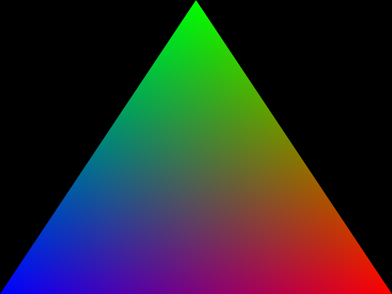
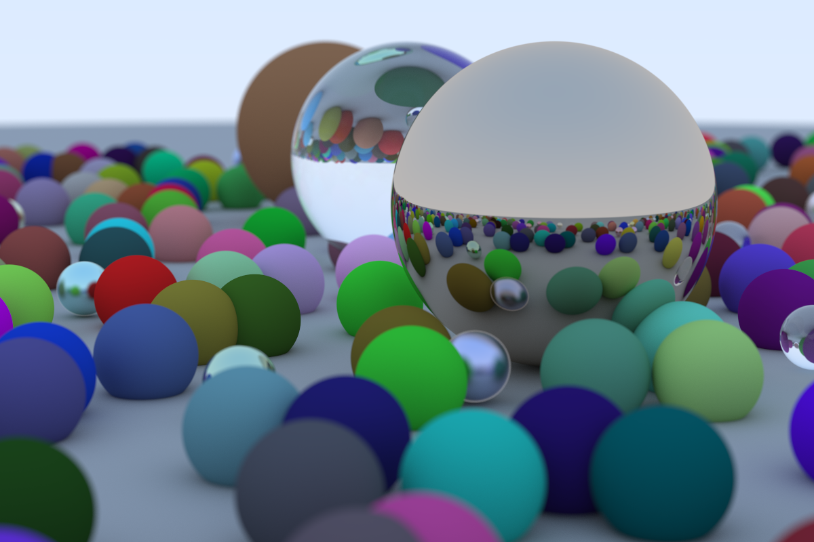
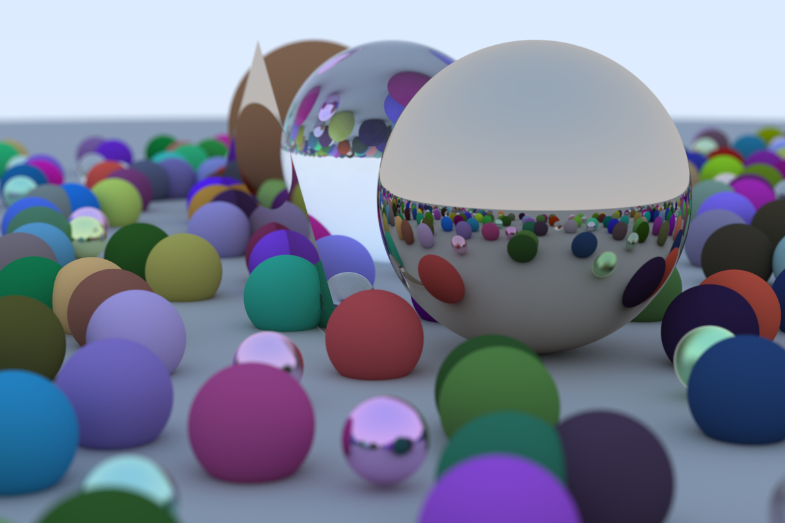

# Zenn CLI

* [📘 How to use](https://zenn.dev/zenn/articles/zenn-cli-guide)

# Example codes

## rasterization-example

Simple example using rust-gpu to render a triangle.

## raytracing-example

Vulkan Raytracing example using rust-gpu.

## raytracing-example-plus

Another Vulkan Raytracing example using more shaders.

