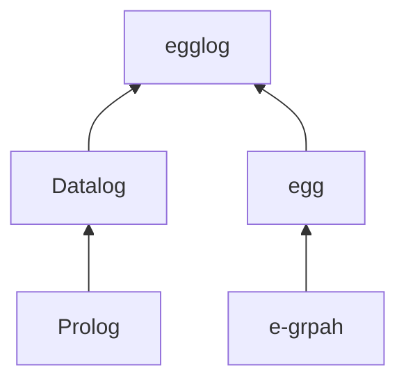

# はじめに

[egglog](https://github.com/egraphs-good/egglog)はdatalogっぽいプログラミング言語で、e-graphによって実行されます。

数式とかプログラムの最適化が得意で、[herbie](https://github.com/herbie-fp/herbie)でも使われたりしているようです。

```mermaid
graph BT;
    Datalog --> egglog;
    Prolog --> Datalog;
    e-grpah --> egg;
    egg --> egglog;
```