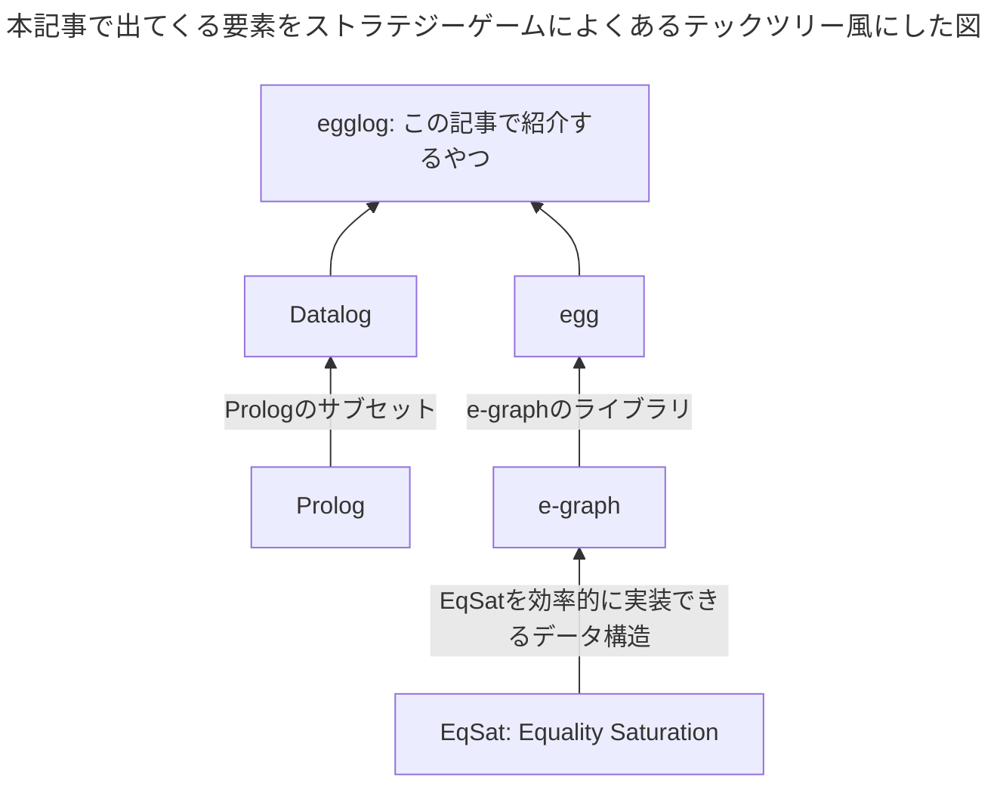

# はじめに

[egglog](https://github.com/egraphs-good/egglog)は[Datalog](https://en.wikipedia.org/wiki/Datalog)っぽいプログラミング言語で、[e-graph](https://en.wikipedia.org/wiki/E-graph)によって実行されます。
汎用的なプログラミング言語ではありませんが^[多分チューリング完全ではあると思うが例えばwebサーバーを書くといったことには適さないという意味]、数式とかプログラムの最適化が得意で[herbie^[浮動小数点数の演算をより誤差が少なくなるように書き換えるプログラム]](https://github.com/herbie-fp/herbie)でも使われたりしています。




以下はグラフの2点間の最短距離を求める`egglog`のサンプルプログラムです。
ちなみにこれだけなら別にめちゃめちゃ最適なアルゴリズムで実行されるというわけでもなくそんなに有用ではないですが、雰囲気はわかると思います。

```egglog:path.egg
; 二点間の距離を定義する
(function edge (i64 i64) i64)
; 二点間の最短距離
(function path (i64 i64) i64 :merge (min old new))

(rule ((= (edge x y) d))
    ((set (path x y) d)))

(rule ((= (path x y) d1) (= (edge y z) d2))
    ((set (path x z) (+ d1 d2))))

; 辺のデータを入れていく
(set (edge 1 2) 1)
(set (edge 2 3) 2)
(set (edge 3 4) 3)
; EqSat実行
(run 3)
; 1-4間の最短距離を出力
(query-extract (path 1 4)) ; 6

; 1-4間にもっと短い経路があることを入力
(set (edge 1 4) 5)

(run 3)

(query-extract (path 1 4)) ; 5
(print-table path)
```

# Equality Saturationとe-graph

egglog自体e-graphをうまく使うためのインターフェースといった感じがあり、Equality Saturationとe-graphの説明は外せないのでここで説明します。

## Equality Saturationが解く問題

例えば、手元にある数式があり、それをあらかじめ決めたルールに従って書き換えていき単純な形^[例えば文字数が少ないとか]にするという問題を考えます。

式 $a*2/2$ を以下のルールに従って書き換えていきます。

1. $x * 2 \to x << 1$
2. $x * 1 \to x$
3. $x/x \to 1$

もちろん$a*2/2$を最終的に$a$に書き換えることを期待しているわけですが、
以下のような単純なアルゴリズムでは必ずしも$a$に書き換えられるとは限りません。

### ある単純なアルゴリズム

1. 手元の式に適用できるルールを適当に探す
2. あればそのルールを手元の式に適用し、元の式は忘れる
3. 適用出来るルールがなくなるまで1,2を繰り返す

このようなアルゴリズムでは、どの順番でルールを適応するかによって結果が大きく変わってしまいます。

- ルール1を最初に選んだ場合 $a*2/2$ ➡️ $(a<<1)/2$ ...これ以上はもう無理
- ルール3を最初に選んだ場合 $a*2/2$ ➡️ $a*1$ ルール2を適用 ➡️ $a$ ...これはOK


*e-graphを説明する有名な図. a\*2/2という数式を書き換えていく様子*