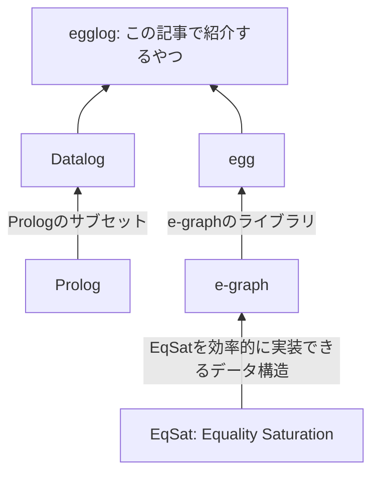

# はじめに

[egglog](https://github.com/egraphs-good/egglog)は[Datalog](https://en.wikipedia.org/wiki/Datalog)っぽいプログラミング言語で、[e-graph](https://en.wikipedia.org/wiki/E-graph)によって実行されます。
汎用的なプログラミング言語ではありませんが^[多分チューリング完全ではあると思うが例えばwebサーバーを書くといったことには適さないという意味]、数式とかプログラムの最適化が得意で[herbie](https://github.com/herbie-fp/herbie)でも使われたりしています。

といってもDatalogもe-graphもピンとこない方がほとんどだと思うので、そこらへんから説明していきます。

以下に本記事で出てくる要素を、ストラテジーゲームによくあるテックツリー風に図にしてみました。




以下はグラフの2点間の最短距離を求めるegglogのサンプルプログラムです。
ちなみにこれだけなら別にめちゃめちゃ最適なアルゴリズムで実行されるというわけでもなくそんなに有用ではないですが、雰囲気はわかると思います。

```egglog:path.egg
; 二点間の距離を定義する
(function edge (i64 i64) i64)
; 二点間の最短距離
(function path (i64 i64) i64 :merge (min old new))

(rule ((= (edge x y) d))
    ((set (path x y) d)))

(rule ((= (path x y) d1) (= (edge y z) d2))
    ((set (path x z) (+ d1 d2))))

; 辺のデータを入れていく
(set (edge 1 2) 1)
(set (edge 2 3) 2)
(set (edge 3 4) 3)
; EqSat実行
(run 3)
; 1-4間の最短距離を出力
(query-extract (path 1 4))

; 1-4間にもっと短い経路があることを入力
(set (edge 1 4) 5)

(run 3)

(query-extract (path 1 4))
(print-table path)
```