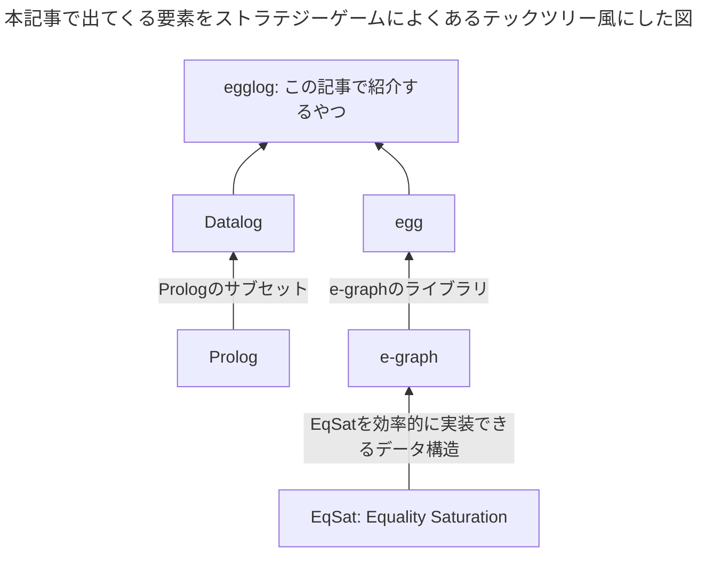

# はじめに

[egglog](https://github.com/egraphs-good/egglog)は[Datalog^[Datalogについてはよくわからないので本記事では触れません🙇]](https://en.wikipedia.org/wiki/Datalog)っぽいプログラミング言語で、[e-graph](https://en.wikipedia.org/wiki/E-graph)によって実行されます。
汎用的なプログラミング言語ではありませんが^[多分チューリング完全ではあると思うが例えばwebサーバーを書くといったことには適さないという意味]、数式とかプログラムの最適化が得意で[herbie^[浮動小数点数の演算をより誤差が少なくなるように書き換えるプログラム]](https://github.com/herbie-fp/herbie)でも使われたりしています。




以下はグラフの2点間の最短距離を求める`egglog`のサンプルプログラムです。
ちなみにこれだけなら別にめちゃめちゃ最適なアルゴリズムで実行されるというわけでもなくそんなに有用ではないですが、雰囲気はわかると思います。

```egglog:path.egg
; 二点間の距離を定義する
(function edge (i64 i64) i64)
; 二点間の最短距離
(function path (i64 i64) i64 :merge (min old new))

(rule ((= (edge x y) d))
    ((set (path x y) d)))

(rule ((= (path x y) d1) (= (edge y z) d2))
    ((set (path x z) (+ d1 d2))))

; 辺のデータを入れていく
(set (edge 1 2) 1)
(set (edge 2 3) 2)
(set (edge 3 4) 3)
; EqSat実行
(run 3)
; 1-4間の最短距離を出力
(query-extract (path 1 4)) ; 6

; 1-4間にもっと短い経路があることを入力
(set (edge 1 4) 5)

; EqSat実行
(run 3)

; 1-4間の最短距離を出力
(query-extract (path 1 4)) ; 5
(print-table path)
```

# Equality Saturationとe-graph

`egglog`自体`e-graph`をうまく使うためのインターフェースといった感じがあり、`Equality Saturation`と`e-graph`の理解は外せないのでここで説明します。

## Equality Saturationが解く問題

手元にあるS式があり、それをあらかじめ決めたルールに従って書き換えていってより良い形^[例えば葉の数が少ないとか]にするという問題を考えます。

例えば、数式を表すS式`(/ (* a 2) 2)`を以下のルールに従って書き換えていきます。

`x`, `y`, `z`は任意のS式を表します。
1. `(* x 2)` を `(<< x 1)`に書き換える。`<<`は左シフトの意味
2. `(* x 1)` を `x`に書き換える。
3. `(/ (* x y) z)` を `(* x (/ y z))`に書き換える。
4. `(/ x x)` を `1`に書き換える^[`(/ 0 0)`を`1`に書き換えてしまうのでこのルールは良くない。例なので許してほしい]。

上のルールを適切な順番で適用していくと、`(/ (* a 2) 2)`を`a`に書き換えられますが、**順番が重要です**。

- ルール1を最初に選んだ場合 `(/ (* a 2) 2)` ➡️ `(/ (<< a 1) 2)` ...これ以上適用できるルールがない
- ルール3を最初に選んだ場合 `(/ (* a 2) 2)` ➡️ `(* a (/ 2 2))` ルール4を適用 ➡️ `(* a 1)` ルール2を適用 ➡️ `a` ...これはOK🎉

つまり適当にルールを適用していく(そして元の値を忘れる)だけでは最適な結果になるとは限らないのです。

第一感でとりあえずビームサーチすれば良さそうに見えますが、この問題に対してはもっと良いアルゴリズム(Equality Saturation)とそれを可能にするデータ構造(e-graph)があります。

## Equality Saturation

Equality Saturationは上の問題をこのように解きます。

1. 手元のS式に対して適用できるルールを全部適用して適用前、適用後のS式をそれぞれ全部覚えておく
2. 1を繰り返す。そのうちなにをどう適用しても新しい情報を得られなくなる(Saturationする😎)。そしたら次に行く
3. 手元にあるS式の中で(なにかの基準で)一番良いものを選んでそれを出力する

実質すべての可能性を探索しているので必ず最適な解が得られます💪
ただ、すべての結果を覚えなければいけないのでデータ構造を工夫しなければなりません。それが`e-graph`です。


*e-graphを説明する有名な図. ((\* a 2) 2)という式を書き換えていく様子*