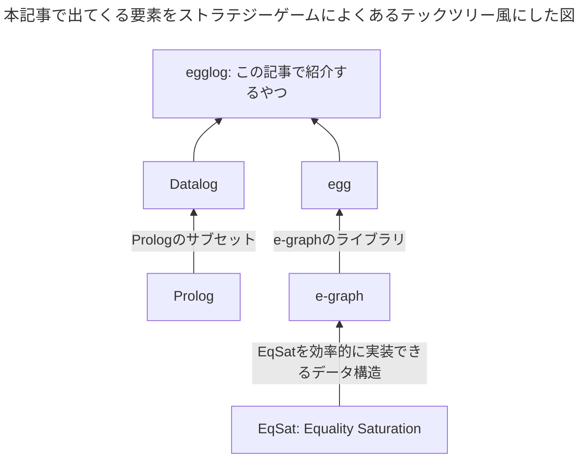

# はじめに

[egglog](https://github.com/egraphs-good/egglog)は[Datalog^[Datalogについてはよくわからないので本記事では触れません🙇]](https://en.wikipedia.org/wiki/Datalog)っぽいプログラミング言語で、[e-graph](https://en.wikipedia.org/wiki/E-graph)によって実行されます。
汎用的なプログラミング言語ではありませんが^[チューリング完全ではあると思うが例えばwebサーバーを書くといったことには適さないという意味]、数式とかプログラムの最適化が得意で[herbie^[浮動小数点数の演算をより誤差が少なくなるように書き換えるプログラム]](https://github.com/herbie-fp/herbie)でも使われたりしています。




以下はグラフの2点間の最短距離を求める`egglog`のサンプルプログラムです。
ちなみにこれだけなら別にめちゃめちゃ最適なアルゴリズムで実行されるというわけでもなくそんなに有用ではないですが、雰囲気はわかると思います。

```scheme:path.egg
; egglogの文法はLispっぽいがLispっぽい機能はない

; 二点間の距離を定義する
(function edge (i64 i64) i64)
; 二点間の最短距離
(function path (i64 i64) i64 :merge (min old new))

(rule ((= (edge x y) d))
    ((set (path x y) d)))

(rule ((= (path x y) d1) (= (edge y z) d2))
    ((set (path x z) (+ d1 d2))))

; 辺のデータを入れていく
(set (edge 1 2) 1)
(set (edge 2 3) 2)
(set (edge 3 4) 3)
; EqSat実行
(run 3) ; 最大3回までイテレーションする。正直3という数字は適当だが文法上必要なので入れている。別に100とかでも良い
; 1-4間の最短距離を出力
(query-extract (path 1 4)) ; 6

; 1-4間にもっと短い経路があることを入力
(set (edge 1 4) 5)

; EqSat実行
(run 3)

; 1-4間の最短距離を出力
(query-extract (path 1 4)) ; 5
(print-table path)
```

# Equality Saturationとe-graph

`egglog`自体`e-graph`をうまく使うためのインターフェースといった感じがあり、`Equality Saturation`と`e-graph`の理解は外せないのでここで説明します。

## Equality Saturationが解く問題

手元にあるS式^[S式みたいな雰囲気のもの。`(x . y)`みたいなやつは考えない]があり、それをあらかじめ決めたルールに従って書き換えていってより良い形^[例えば葉の数が少ないとか]にするという問題を考えます。このとき書き換える前と後はなにかの基準で同じ意味を持つ(Equality)ようにルールを作ります。

例えば、数式を表すS式`(/ (* a 2) 2)`を以下のルールに従って書き換えていきます。
ご存知の通り$(a \times 2) / 2 = a$なので、最終的には`a`に書き換えられればOKです。

`x`, `y`, `z`は任意のS式を表します。
1. `(* x 2)` を `(<< x 1)`に書き換える。`<<`は左シフトの意味
2. `(* x 1)` を `x`に書き換える。
3. `(/ (* x y) z)` を `(* x (/ y z))`に書き換える。
4. `(/ x x)` を `1`に書き換える^[`(/ 0 0)`を`1`に書き換えてしまうのでこのルールは良くない。例なので許してほしい]。

上のルールを適切な順番で適用していくと、`(/ (* a 2) 2)`を`a`に書き換えられますが、**順番が重要です**。

- ルール1を最初に選んだ場合 `(/ (* a 2) 2)` ➡️ `(/ (<< a 1) 2)` ...これ以上適用できるルールがない
- ルール3を最初に選んだ場合 `(/ (* a 2) 2)` ➡️ `(* a (/ 2 2))` ルール4を適用 ➡️ `(* a 1)` ルール2を適用 ➡️ `a` ...これはOK🎉

つまり適当にルールを適用していく(そして元の式を忘れる)だけでは最適な結果になるとは限らないのです。

これは最適化問題の頻出系なのでとりあえずビームサーチすればどうにかなりそうに見えますが、この問題に対してはもっと良いアルゴリズム(Equality Saturation)とそれを可能にするデータ構造(e-graph)があります。

## Equality Saturation

Equality Saturationは上の問題をこのように解きます。

1. 手元のS式に対して適用できるルールを全部適用して適用前、適用後の情報を全部覚えておく
2. 1を繰り返す。そのうちどのルールをどう適用しても新しい情報を得られなくなる(Saturationする😎)ので、そしたら次に行く
3. 手元にあるS式の中で(なにかの基準で)一番良いものを選んでそれを出力する

実質すべての可能性を探索しているので必ず最適な解が得られます💪
ただ、過程ででてきたすべての情報を覚えなければいけないのでデータ構造を工夫しなければなりません。それが`e-graph`です。

## e-graph

`e-graph`は上で言うS式とその合同^[congruence。"等しい(equal)"とは少し意味合いが違うがとりあえず特に気にしなくて良い]関係をグラフにして保存します。グラフの表現力はすごいので、指数関数的な増えるS式を効率的に表すことができます。

`e-graph`は`node`と`e-class`を保存します。`node`の子は`e-class`で、`e-class`は合同な`node`の集合です。また、`node`は常にただ一つの`e-class`に属します。
上の例でいうと`node`はS式を表し、`e-class`は合同なS式の集合を表します。例えば`(* a 1)`と`a`はルール2によって合同だとみなせるので同じe-classに属すはずです。

`e-graph`に対してルールを適用していくと、効率的に空間を使いながら、今までの情報を失うことなく新しい情報を`e-graph`に足していくことができます。


*[`egg`のサイト](https://egraphs-good.github.io/)にある図. `(/ (* a 2) 2)`を書き換えていく様子を表している*

図の実線で囲われている四角とそこから伸びている線は`node`を表し、点線で囲われている四角は`e-class`を表しています。
`node`から伸びている線はすべて`e-class`につながっていることに注意してください。

上の例でいうと`(/ (* a 2) 2)`は図の左端のように表現できます。例えば`2`はそれ自体が`node`で`2`と合同な`node`は今のところ存在していないので`2`一つで一個の`e-class`です。`(/ (* a 2) 2)`には2回`2`が出てきますがどちらも同じ`node`を指しているので同じ`e-class`に線が来ています。

`(* a 2)`を`(<< a 1)`に書き換えたので左から二番目です。`(* a 2)`と`(<< a 1)`はルール1によって合同なので同じ`e-class`に属しています。

そういう具合に`e-graph`にルールを適応していくと最終的にこれ以上ルールを適用できなくなり図の右端のようになります。`(/ (* a 2) 2)`と`a`が同じ`e-class`に属しているので、`(/ (* a 2) 2)`は`a`になりました🎉。

`e-graph`を具体的にどう実装するかは本記事ではふれませんが[egg: Fast and extensible equality saturation](https://dl.acm.org/doi/10.1145/3434304)によく書いてあるので興味があれば読んでみてください。

## egg

[egg](https://github.com/egraphs-good/egg)は`e-graph`のライブラリです。`egglog`自体は`egg`に依存していませんが実質同じようなものが`egglog`に入っていると考えていいです。

`egg`の特徴は、ユーザーが明示的にEquality Saturationを実行しなければならいないことです。
古典的な`e-graph`の実装ではユーザーがルールを追加したりしたときに自動的にEquality Saturationを実行するのですが、`egg`ではユーザーのタイミングでまとめてEquality Saturationを実行するのでより効率的になっています。

なので`egglog`でも上の方にあるサンプルコードのように、Equality Saturationを明示的に`(run 3)`みたいなやつで実行する必要があります。

# egglog

前置きが終わったので`egglog`の話に入ります。

## 環境構築

手軽に試したい場合はWeb上で動く[デモ](https://egraphs-good.github.io/egglog/)があります。

ローカルで実行する場合は特にバイナリ等はまだ配布されていないので、`cargo`をでビルドします。
`cargo`はRusばついてきます。

```sh
cargo install --git https://github.com/egraphs-good/egglog
```

自作ですがVSCodeの拡張もあるので入れておくと便利です。公式の拡張も一応ありますが全然更新されてないのでおすすめしません。
[egglog-language](https://marketplace.visualstudio.com/items?itemName=hatookov.egglog-language)

## 実行方法

他の言語処理系と同じように、`egglog`にソースコードを渡すと実行されます。拡張子は`.egg`にするのが慣習です。

```sh
egglog ${file}
```

`egglog -h`で他に何が出来るかわかりますが、特に重要なのは以下です。

- `egglog --desugar ${file}`: 糖衣構文を展開して出力する
- `egglog --to-svg ${file}`: 実行結果の`e-graph`の内部表現を出力する

VSCodeの拡張を入れている場合は糖衣構文の展開結果をマウスオーバーで見ることができます。

*`(datatype BDD (ITE i64 BDD BDD))`は`(sort BDD) (function ITE (i64 BDD BDD) BDD)`に展開されることがわかる*


## 基本的な文法

`egglog`のパーサーは[lalrpop](https://github.com/lalrpop/lalrpop)で実装されているので比較的短い`lalrpop`の[BNFっぽいDSL](https://github.com/egraphs-good/egglog/blob/main/src/ast/parse.lalrpop)を文法がわかります。
