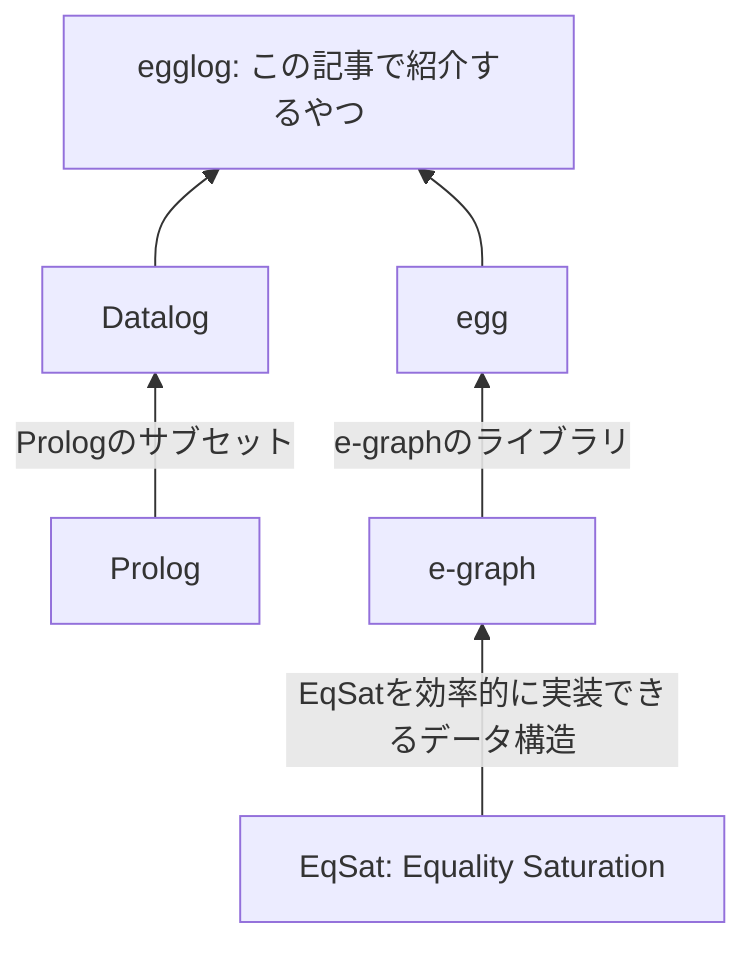

# はじめに

[egglog](https://github.com/egraphs-good/egglog)は[Datalog](https://en.wikipedia.org/wiki/Datalog)っぽいプログラミング言語で、[e-graph](https://en.wikipedia.org/wiki/E-graph)によって実行されます。
数式とかプログラムの最適化が得意で、[herbie](https://github.com/herbie-fp/herbie)でも使われたりしています。

といってもDatalogもe-graphもピンとこない方がほとんどだと思うので、そこらへんから説明していきます。

以下に本記事で出てくる要素をストラテジーゲームによくあるテックツリー風に図にしてみました。

