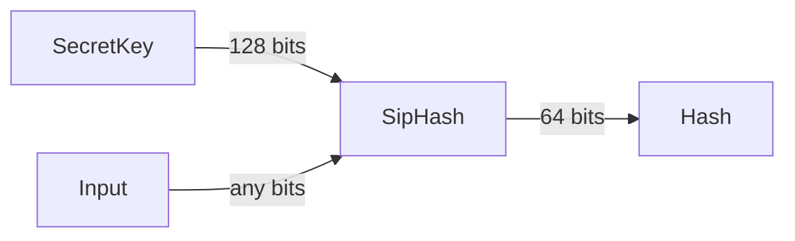

この記事は[Rust Advent Calendar 2023](https://qiita.com/advent-calendar/2023/rust)の14日目の記事です。

# はじめに

[SipHash](https://web.archive.org/web/20180829083106/http://131002.net/siphash/)はRustの標準ライブラリの[`std::collections::HashMap`](https://doc.rust-lang.org/std/collections/struct.HashMap.html)などでデフォルトで使われるハッシュアルゴリズムです。
HashDos攻撃に対する耐性がありデフォルトのアルゴリズムとして相応しいですが、個人的にHashMapの速度を上げたいときに適当に(耐性のない)他のアルゴリズムに変えてしまいがちなので今回ちゃんと調べてみました。

# SipHashとは

## Overview

SipHashは[PRF](https://en.wikipedia.org/wiki/Pseudorandom_function_family)の一種で



128bitの秘密鍵と任意の長さの入力から64bitのハッシュ値を生成します。
秘密鍵の内容がバレていない限り、入力がどのようなハッシュ値になるかは予測できないのでHashDos攻撃に対して耐性があるというわけです。

### Rustでの秘密鍵の生成

Rustの標準ライブラリでは秘密鍵の生成に、最初だけちゃんとOSから乱数を取得してそれ以降はその値をthread_localに保持して一ずつインクリメントしていくという方法を取っています。

https://github.com/rust-lang/rust/blob/1a3aa4ad149438a9b11f758c16df9e222de51f91/library/std/src/hash/random.rs#L55-L77

毎回OSから乱数を取得すると遅かったということがコメントに書いてあります。

## アルゴリズム

SipHashのアルゴリズムを[Rustの標準ライブラリの実装](https://github.com/rust-lang/rust/blob/1a3aa4ad149438a9b11f758c16df9e222de51f91/library/core/src/hash/sip.rs)とともに見ていきます。

1. k0, k1のu64を2つ、合計128bitの秘密鍵と固定値で内部状態を初期化する

https://github.com/rust-lang/rust/blob/1a3aa4ad149438a9b11f758c16df9e222de51f91/library/core/src/hash/sip.rs#L204-L213

XORしてる固定値は`b'somepseudorandomgeneratedbytes'`のASCIIコードから来ています
とにかくv0-3の各状態が別の値になればいいっぽいです。

```python
# python
>>> ''.join(['%x' % c for c in b'somepseudorandomgeneratedbytes'])
'736f6d6570736575646f72616e646f6d67656e6572617465646279746573'
```

2. (入力の残りが8バイト未満になるまで)8バイトずつ入力を読み込んで内部状態を更新する

`mi`には入力が64bit区切りで入ってきます。
やっていることは`c_rounds`を呼ぶ前後に内部状態に入力をXORしているだけです。

https://github.com/rust-lang/rust/blob/1a3aa4ad149438a9b11f758c16df9e222de51f91/library/core/src/hash/sip.rs#L286-L297

肝心の`c_rounds`はRustの標準ライブラリではSipHashの中でもSipHash-1-3という種類が使われているので、`compress!`を一回だけ呼び出しています。
SipHash-1-3の1の部分が入力の8バイトチャンクに対して一回だけ`compress!`を呼び出すということを示しています。

https://github.com/rust-lang/rust/blob/1a3aa4ad149438a9b11f758c16df9e222de51f91/library/core/src/hash/sip.rs#L363-L375

`compress!`はマクロで定義されています(コンパイラの最適化が信用できなかったのかな？)
とにかく、wrapping_add(Add), rotate_left, XORの3つの演算を繰り返して内部状態を更新しています。
上記の三種類の演算のみを用いているこのような関数を頭文字を取ってARXと呼ぶそうです。
特別な命令(AES命令とか)を必要としないのでローエンドなCPUでも高速に動作するという利点があるそうです。

https://github.com/rust-lang/rust/blob/1a3aa4ad149438a9b11f758c16df9e222de51f91/library/core/src/hash/sip.rs#L75-L93


*[SipHash: a fast short-input PRF Jean-Philippe Aumasson and Daniel J. Bernstein](https://web.archive.org/web/20180829083109/http://131002.net/siphash/siphash.pdf)から引用した画像*

各回転の数は機械的に試して決めたそうです。

3. 最終出力

入力の残りが8バイト未満になったら、`入力の長さ`%`255`を入れて内部状態を更新して、その後に`0xff`をv2にXORして`d_rounds`を呼び出して内部状態を更新して、最後にv0-3をXORして出力します。
SipHash1-3なので`d_rounds`は3回`compress!`を呼び出します。

https://github.com/rust-lang/rust/blob/1a3aa4ad149438a9b11f758c16df9e222de51f91/library/core/src/hash/sip.rs#L314-L329

# SipHashの種類

`SipHash-c-d`という表記でSipHashのラウンド数を表します。各８バイトのチャンクに対して`c`回`compress!`を呼び出し、最後に`d`回`compress!`を呼び出します。
論文には`SipHash-2-4`がおすすめされていますが、Rustの標準ライブラリでは`SipHash-1-3`が使われています。
SipHashのデザイナーのJean-Philippe Aumasson^[[Serious Cryptography](https://nostarch.com/seriouscrypto)の著者でもあります]氏的にもSipHash-1-3で十分なようです(https://github.com/rust-lang/rust/issues/29754)。

# 他のアルゴリズムとの比較

SipHashはその当時の自明な対抗馬であるHMAC-SHA1よりも高速で、特に短い入力に対して最適化されているのでHashMapのようなデータ構造に使うのに適しています。
HMAC-SHA1は安全ですがどうせ秘密鍵を使うのでSHA1より計算量を少なくしても安全性を保てる(超意訳)ということのようです。

# 歴史

- 2015-05 Rust 1.0.0リリース。このときはSipHash2-4が使われていた https://github.com/rust-lang/rust/blob/1.0.0/src/libcore/hash/sip.rs
- 2015-11 SipHash1-3でも十分だということでSipHash2-4からSipHash1-3に変更
    - https://github.com/rust-lang/rust/issues/29754
    - RubyでもSipHash2-4からSipHash1-3に変更された https://bugs.ruby-lang.org/issues/13017
- 2016-08 SipHashの実装をアセンブリとかで高速化する案がでたがあんまり変わらなかったのでやめる
    - https://github.com/rust-lang/rust/issues/35735