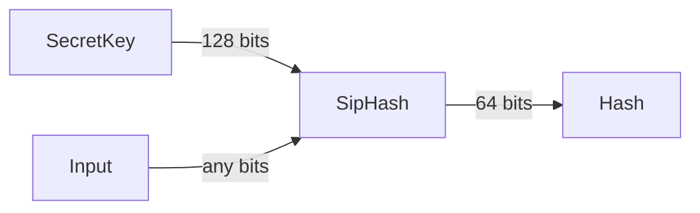

この記事は[Rust Advent Calendar 2023](https://qiita.com/advent-calendar/2023/rust)の14日目の記事です。

# はじめに

[SipHash](https://web.archive.org/web/20180829083106/http://131002.net/siphash/)はRustの標準ライブラリの[`std::collections::HashMap`](https://doc.rust-lang.org/std/collections/struct.HashMap.html)などでデフォルトで使われるハッシュアルゴリズムです。
HashDos攻撃に対する耐性がありデフォルトのアルゴリズムとして相応しいですが、個人的にHashMapの速度を上げたいときに適当に(耐性のない)他のアルゴリズムに変えてしまいがちなので、今回ちゃんと調べてみました。

# SipHashとは

## Overview

SipHashは[PRF](https://en.wikipedia.org/wiki/Pseudorandom_function_family)の一種で



128bitの秘密鍵と任意の長さの入力から64bitのハッシュ値を生成します。
秘密鍵の内容がバレていない限り、入力がどのようなハッシュ値になるかは予測できないのでHashDos攻撃に対して耐性があるというわけです。

### Rustでの秘密鍵の生成

Rustの標準ライブラリでは秘密鍵の生成に、最初だけちゃんとOSから乱数を取得してそれ以降はその値をthread_localに保持して一個ずつインクリメントしていくという方法を取っています。

https://github.com/rust-lang/rust/blob/1a3aa4ad149438a9b11f758c16df9e222de51f91/library/std/src/hash/random.rs#L55-L77

毎回OSから乱数を取得すると遅かったということがコメントに書いてあります。

## アルゴリズム

SipHashのアルゴリズムを[Rustの標準ライブラリの実装](https://github.com/rust-lang/rust/blob/1a3aa4ad149438a9b11f758c16df9e222de51f91/library/core/src/hash/sip.rs)とともに見ていきます。

1. k0, k1のu642つ、合計128bitの秘密鍵と固定値で内部状態を初期化する

https://github.com/rust-lang/rust/blob/1a3aa4ad149438a9b11f758c16df9e222de51f91/library/core/src/hash/sip.rs#L204-L213

XORしてる固定値は`b'somepseudorandomgeneratedbytes'`のASCIIコードから来ています
とにかくv0-3の各状態が別の値になればいいっぽいです。

```python
# python
>>> ''.join(['%x' % c for c in b'somepseudorandomgeneratedbytes'])
'736f6d6570736575646f72616e646f6d67656e6572617465646279746573'
```