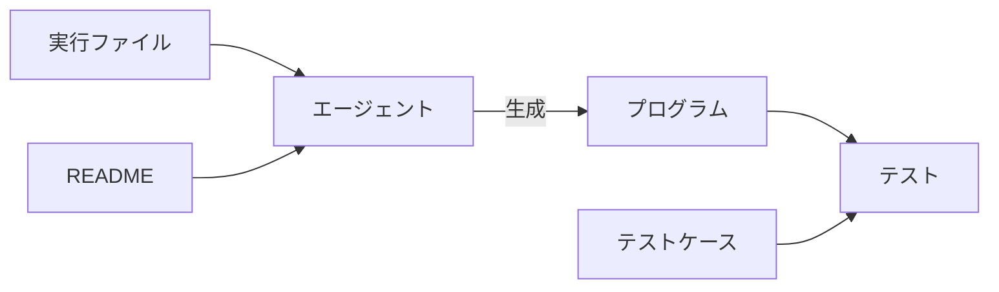

# はじめに

[ProgramBench](https://programbench.com/)のテストケースに自分が書いた[hatoo/oha](https://github.com/hatoo/oha)が入っていたのでテストケースを見てみます

# ProgramBench

ProgramBenchは2026年5月に公開されたLLMベンチマークです。
エージェントにはターゲットのバイナリと簡単なドキュメントが渡されて、そのバイナリと同じ動作をするようなプログラムを作ります。
エージェントは実行権限のみ、読み取り権限なしのバイナリの動作を読み解いてプログラムを作り、最後に非公開なテストケースでそのプログラムが評価されます。テストケースは別のAIで自動生成。
不正防止のため、**インターネットアクセスはできません**。なので標準ライブラリのみでプログラミングしなければならない。
使用するプログラミング言語は自由に選べます



ランキングトップのGPT 5.5 (xhigh)はohaの78.6%のテストケースを通ったらしい
200個テストケースがあるので大体半分くらいの難しさか


# [hatoo/oha](https://github.com/hatoo/oha)

エージェントにはohaの説明として[README.md](https://github.com/hatoo/oha/blob/master/README.md)が開示されている


[hatoo/oha](https://github.com/hatoo/oha)は**HTTPのベンチマークツール**です。
基本的に、引数にURLが与えられてそこにできるだけ速くHTTPリクエストを規定の量送って結果のサマリを出します。

# ベンチマークについて思ったこと

実際の生成結果を見たわけではないので想像

インターネットアクセス禁止が普通にしんどそう。
ohaではTLS、HTTP/2をサポートしているので標準ライブラリにそれらがない言語だと流石にAIでも無理そう。(Goが良さそうか？)
逆に実行速度については特にテストされないので、それはまだ楽そう


# テストケース見てみる

[Hugging Face](https://huggingface.co/datasets/programbench/ProgramBench-Tests)にテストケースがあったので見てみた
tarballでアップロードされているので以下の記事では参照リンクを貼れなかった
そもそもLLMに学習されないためにわざとtarballにアップロードしていると思うのでこの記事を公開してしまうのも良くないのでは？とちょっと思ったが考えても仕方ないので抜粋したテストケースはそのまま載せる

## TUI

ohaはTUIで実行状況が見れるのがウリでもあるのだがTUIのテストもあった

例えばこんなの
```python
def test_tui_quit_with_q():
    """CATCHES: TUI that doesn't respond to 'q' key for quitting, requires Ctrl-C
    or other quit methods, or crashes instead of cleanly exiting and showing the
    final summary when 'q' is pressed during an active load test.

    Golden files:
        None - this test verifies quit behavior
    """
    SESSION = "test_tui_quit_q"
    try:
        # Start with long duration
        tui(["start", "--", "./executable", "-z", "60s", "-c", "1", "http://example.com"], SESSION)
        time.sleep(2)
        
        # Press q to quit
        tui(["send-keys", "q"], SESSION)
        time.sleep(0.5)
        
        # Should show final summary
        result = tui(["snapshot"], SESSION)
        
        # Process should have exited
        assert "<NOTE>The process has exited." in result
        
        # Should still show summary statistics
        assert "Response time distribution:" in result
        assert "Status code distribution:" in result
        
    finally:
        subprocess.run(
            [str(TUI2CLI), "-n", SESSION, "stop"],
            capture_output=True,
            timeout=2,
            cwd=str(WORKSPACE)
        )
```
ohaはTUI画面で`q`を押すと終了することをテストしている。

よく考えたら`q`で終了できることをドキュメントに書いた記憶がない(`Ctrl-c`でも終了できるよ)のでエージェントがどれだけ仕様をバイナリ実行からから自分で探せるかが試されてる気がする。

## --rand-regex-url

ohaでは`--rand-regex-url`で簡易的にリクエストを動的に変えることができる。
`regex`の逆みたいな感じで動き、正規表現のパターンからマッチする文字列をランダムに使用する。

### 例

```python
    result = run_oha([
        "--no-tui",
        "--rand-regex-url",
        "--dump-urls", "10",
        "http://127.0.0.1:8765/[a-z][0-9]"
    ], check=False)
```

- http://127.0.0.1:8765/d9
- http://127.0.0.1:8765/y5

とかのURLをランダムに生成する

ohaでは[kennytm/rand_regex](https://github.com/kennytm/rand_regex)で実装しているがAIも意外に簡単に実装してしまったりするのだろうか

## HTTP2

どうやら実際にHTTP/2を実装しているかをテストしているケースが見つからない
Pyhtonで外部ライブラリなしでHTTP/2サーバーを作る方法がないからか？

てきとうすぎる
```python
def test_http2_flag(self, http_server):
        """Test HTTP/2 flag (--http2)."""
        url = f"http://127.0.0.1:{http_server.port}/"
        # Note: HTTP/2 to HTTP/1.1 server may fail or downgrade
        result = run_oha(["-n", "2", "--http2", "--no-tui", url], check=False)
        # Check it doesn't crash
        assert result.returncode in [0, 1]
```

https://www.google.com へのテストもあるけどgoogleはHTTP/1.1も受け付けているので微妙
```python
def test_http_version_http2_flag():
    """CATCHES: implementations that don't handle --http2 flag correctly - should
    set HTTP version to HTTP/2 and make successful requests."""
    result = run_oha(
        ["--http2", "-n", "1", "--no-tui", "--output-format", "json",
         "https://www.google.com"],
        check=False,
        timeout=10,
    )
    
    assert result.returncode == 0
    data = json.loads(result.stdout)
    # Request should complete
    assert data["summary"]["requestsPerSec"] > 0
```

oha本体ではhttpなHTTP/2サーバーを立ててテストしてる

## latency correction

ohaは`-q`でレートリミットがあるときに`--latency-correction`を設定すると実際のタイミングにかかわらず仮想的に毎秒`-q`回リクエストがあったことにしてタイミングを書き換える。

```python
def test_latency_correction_flag():
    """CATCHES: implementations that don't handle --latency-correction flag correctly
    when combined with QPS limiting - should adjust timing to account for request latency."""
    result = run_oha(
        ["-q", "10", "--latency-correction", "-n", "5", "--no-tui",
         "--output-format", "json", "http://example.com"],
        check=False,
        timeout=10,
    )
    
    assert result.returncode == 0
    data = json.loads(result.stdout)
    # Should complete with latency correction enabled
    assert data["summary"]["requestsPerSec"] > 0
```

テストでは何もテストしてない。
本体でもめんどくてテストしてない。

## SQLite

ohaではリクエストタイミングなどの全部のデータをSQLiteに保存するオプションが有る。該当するテストケースでもちゃんと中身を見ている。
PythonはSQLiteを標準ライブラリを持っているがHTTP/2はない。

## 色

### 環境変数

ohaは`NO_COLOR`環境変数があるときは色無しで出力するようになっている。エージェントはちゃんと動作に気付けるのか…

### ベンチマーク結果の色

ohaではベンチマーク結果の成功率によって色を変えている。
特に>= 99.0% かつ < 100%ときに黄色にする。エージェントが気付けるか心配です。

```python
def test_success_rate_99_percent_yellow_styling():
    """CATCHES: implementations that don't trigger yellow styling for success rates >= 99.0% but < 100%
    — line 32-33 in printer.rs checks success_rate >= 99.0 to apply yellow bold style, which is skipped
    if this branch isn't tested. Yellow bold style is applied when success rate is exactly between
    99.0% and 99.99%."""
```

## ザルテスト

```python
def test_proxy_with_http_connect_to():
    """CATCHES: proxy + connect-to URI rewriting logic.
    
    TARGETS: Lines 983, 988-993 in client.rs - connect-to with proxy
    """
    class SimpleProxy(BaseHTTPRequestHandler):
        def do_GET(self):
            # Simple proxy that just returns success
            self.send_response(200)
            self.send_header('Content-Type', 'text/plain')
            self.end_headers()
            self.wfile.write(b'proxied\n')
        def log_message(self, format, *args):
            pass
    
    proxy = HTTPServer(('127.0.0.1', 8810), SimpleProxy)
    thread = threading.Thread(target=proxy.serve_forever, daemon=True)
    thread.start()
    time.sleep(0.5)
    
    try:
        result = run_oha([
            '--no-tui', '-n', '2', '-c', '1', '--output-format', 'json',
            '-x', 'http://127.0.0.1:8810',
            '--connect-to', 'example.com:80:127.0.0.1:8810',
            'http://example.com/'
        ], timeout=10, check=False)
        
        # Exercises proxy + connect-to code path
        assert result.returncode in (0, 1)
    finally:
        proxy.shutdown()
```

```
        assert result.returncode in (0, 1)
```

って簡単すぎない？？こういうの多かった

# おわりに

偶然自分が書いたプログラムがProgramBenchにあったのでテストケース見てみた。
テストケースはとくにHTTP/2のところなどがザルだった。
テストケースでは実際にサーバー側からリクエストを検証するコードが少なく、ただ単に成功したふうの出力を返すだけのプログラムでもある程度Passしそう。