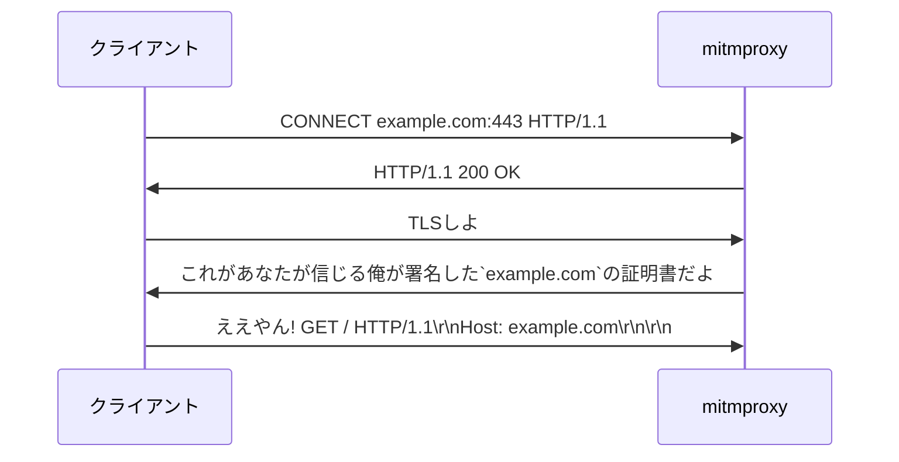

# はじめに

Rustで[mitmproxy](https://mitmproxy.org/)みたいなやつを作れるライブラリを公開したのでそのときに学んだことを書きます。リポジトリはこちら。
https://github.com/hatoo/http-mitm-proxy

## mitmproxyとは

[mitmproxy](https://mitmproxy.org/)は、HTTPのプロキシサーバーで、HTTPSの通信の内容も見ることができるのが特徴です。

## HTTPプロキシ

HTTPプロキシはHTTPのレベルで動作するプロキシです。なのでプロキシ側もHTTPを理解ってなければなりません。

### HTTPの通信(プロキシなし)

```bash
printf "GET / HTTP/1.1\r\nHost: example.com\r\nConnection: close\r\n\r\n" | nc example.com 80
HTTP/1.1 200 OK
Accept-Ranges: bytes
Age: 360610
Cache-Control: max-age=604800
Content-Type: text/html; charset=UTF-8
Date: Mon, 18 Nov 2024 06:44:56 GMT
Etag: "3147526947+gzip"
Expires: Mon, 25 Nov 2024 06:44:56 GMT
Last-Modified: Thu, 17 Oct 2019 07:18:26 GMT
Server: ECAcc (sac/256D)
Vary: Accept-Encoding
X-Cache: HIT
Content-Length: 1256
Connection: close

... # 以下Body (省略)
```

### HTTPの通信(プロキシを使う)

```bash
printf "GET http://example.com/ HTTP/1.1\r\nHost: example.com\r\nConnection: close\r\n\r\n" | nc localhost 3003 # http://localhost:3003 HTTPにプロキシを立てている
HTTP/1.1 200 OK
... # 同じなので以下省略
```

このようにいつもなら`GET / HTTP/1.1`と送るところを`GET http://example.com/ HTTP/1.1`と送ることでプロキシにどこにアクセスしたいかを伝えることができます。
プロキシが相手と通信して結果を返してくれるので、プロキシ側で内容を見たり編集したりすることができます。

### HTTPSの通信(プロキシなし)

```bash
printf "GET / HTTP/1.1\r\nHost: example.com\r\nConnection: close\r\n\r\n" | ncat --ssl example.com 443
... # 同じなので以下省略
```

### HTTPSの通信(プロキシを使う)

これは特殊なのでcurlでやってみます。

```bash
curl -v https://example.com -x http://localhost:3003
*   Trying 127.0.0.1:3003...
* Connected to (nil) (127.0.0.1) port 3003 (#0)
* allocate connect buffer!
* Establish HTTP proxy tunnel to example.com:443
> CONNECT example.com:443 HTTP/1.1
> Host: example.com:443
> User-Agent: curl/7.81.0
> Proxy-Connection: Keep-Alive
>
< HTTP/1.1 200 OK
< Date: Mon, 18 Nov 2024 10:17:21 GMT
<
* Proxy replied 200 to CONNECT request
* CONNECT phase completed!
* ALPN, offering h2
* ALPN, offering http/1.1
*  CAfile: /etc/ssl/certs/ca-certificates.crt
*  CApath: /etc/ssl/certs
* TLSv1.0 (OUT), TLS header, Certificate Status (22):
* TLSv1.3 (OUT), TLS handshake, Client hello (1):
* TLSv1.2 (IN), TLS header, Certificate Status (22):
* TLSv1.3 (IN), TLS handshake, Server hello (2):
* TLSv1.2 (OUT), TLS header, Finished (20):
* TLSv1.3 (OUT), TLS change cipher, Change cipher spec (1):
* TLSv1.2 (OUT), TLS header, Certificate Status (22):
* TLSv1.3 (OUT), TLS handshake, Client hello (1):
* TLSv1.2 (IN), TLS header, Finished (20):
* TLSv1.2 (IN), TLS header, Certificate Status (22):
* TLSv1.3 (IN), TLS handshake, Server hello (2):
* TLSv1.2 (IN), TLS header, Supplemental data (23):
* TLSv1.3 (IN), TLS handshake, Encrypted Extensions (8):
* TLSv1.2 (IN), TLS header, Supplemental data (23):
* TLSv1.3 (IN), TLS handshake, Certificate (11):
* TLSv1.2 (IN), TLS header, Supplemental data (23):
* TLSv1.3 (IN), TLS handshake, CERT verify (15):
* TLSv1.2 (IN), TLS header, Supplemental data (23):
* TLSv1.3 (IN), TLS handshake, Finished (20):
* TLSv1.2 (OUT), TLS header, Supplemental data (23):
* TLSv1.3 (OUT), TLS handshake, Finished (20):
* SSL connection using TLSv1.3 / TLS_AES_256_GCM_SHA384
* ALPN, server accepted to use h2
* Server certificate:
*  subject: C=US; ST=California; L=Los Angeles; O=Internet�Corporation�for�Assigned�Names�and�Numbers; CN=www.example.org
*  start date: Jan 30 00:00:00 2024 GMT
*  expire date: Mar  1 23:59:59 2025 GMT
*  subjectAltName: host "example.com" matched cert's "example.com"
*  issuer: C=US; O=DigiCert Inc; CN=DigiCert Global G2 TLS RSA SHA256 2020 CA1
*  SSL certificate verify ok.
* Using HTTP2, server supports multiplexing
* Connection state changed (HTTP/2 confirmed)
* Copying HTTP/2 data in stream buffer to connection buffer after upgrade: len=0
* TLSv1.2 (OUT), TLS header, Supplemental data (23):
* TLSv1.2 (OUT), TLS header, Supplemental data (23):
* TLSv1.2 (OUT), TLS header, Supplemental data (23):
* Using Stream ID: 1 (easy handle 0x559036dbdeb0)
* TLSv1.2 (OUT), TLS header, Supplemental data (23):
> GET / HTTP/2
> Host: example.com
> user-agent: curl/7.81.0
> accept: */*
>
* TLSv1.2 (IN), TLS header, Supplemental data (23):
* TLSv1.3 (IN), TLS handshake, Newsession Ticket (4):
* TLSv1.2 (IN), TLS header, Supplemental data (23):
* TLSv1.3 (IN), TLS handshake, Newsession Ticket (4):
* old SSL session ID is stale, removing
* TLSv1.2 (IN), TLS header, Supplemental data (23):
* TLSv1.2 (OUT), TLS header, Supplemental data (23):
* TLSv1.2 (IN), TLS header, Supplemental data (23):
* TLSv1.2 (IN), TLS header, Supplemental data (23):
* TLSv1.2 (IN), TLS header, Supplemental data (23):
< HTTP/2 200
< age: 533083
< cache-control: max-age=604800
< content-type: text/html; charset=UTF-8
< date: Mon, 18 Nov 2024 10:17:23 GMT
< etag: "3147526947+gzip+ident"
< expires: Mon, 25 Nov 2024 10:17:23 GMT
< last-modified: Thu, 17 Oct 2019 07:18:26 GMT
< server: ECAcc (sac/251E)
< vary: Accept-Encoding
< x-cache: HIT
< content-length: 1256
<
* TLSv1.2 (IN), TLS header, Supplemental data (23):
* TLSv1.2 (IN), TLS header, Supplemental data (23):
... # 以下Body省略
* Connection #0 to host (nil) left intact
```

最初にプロキシに`CONNECT example.com:443 HTTP/1.1`と送ることでプロキシに対して`example.com:443`との通信を要求します。
その後はexample.com:443とTCPのレベルでトンネリングされるのでそこから普通にHTTPSの通信を行います。(この例ではexmaple.comとHTTP/2で通信しています)
トンネリングされたあとの通信は暗号化されているのでプロキシ側で内容を見ることはできず、編集してもバレます。

## mitmproxyの仕組み

上記のように通常のプロキシはHTTPSの通信を見ることができませんが、mitmproxyはあらかじめクライアントに対して自分の証明書をルート証明書として信用してもらうことで、クライアントが送るデータをすべて見ることができます。
各中継先の証明書はその場でmitmproxyが署名します。



このあとプロキシ側は本当に`example.com`に対するプロキシとして振る舞っても、別に適当にレスポンスを作って返してもいいです。

## HTTP Upgrade

https://developer.mozilla.org/ja/docs/Web/HTTP/Headers/Upgrade

HTTP/1.1の通信は途中で別のプロトコルにUpgradeすることがあります。プロキシはこれも考慮する必要があります。
ブラウザはWebSocketにしかUpgradeすることができない気がします(ソース見つからず)。

# Rustでやる

基本的にブラウザがプロキシを使う想定です。

https://github.com/hatoo/http-mitm-proxy

## 使用したライブラリと所感

### [hyper](https://github.com/hyperium/hyper)

HTTPライブラリ。結構いい感じに低レベルなのが非常に良い。インターフェースが非常に洗練されている。多少とっつきづらいと思っても結局こいつのほうが理にかなっている。

[hyper::body::Incoming](https://docs.rs/hyper/latest/hyper/body/struct.Incoming.html)を使えば
- Content-Lengthで指定された長さのBody
- Transfer-Encoding: chunkedのBody
- Server-Sent Event
- その他なにかあるかもしれない

が全対応なので気にしなくていい。

HTTP/2までサポートしているがHTTP/3はまだサポートしていない。

### [rustls](https://github.com/rustls/rustls)

Rust製のTLSライブラリ。`async`のときのブロッキングの仕方などが`native-tls`よりも良い感じな気がする。ただセキュリティ上問題のあるアルゴリズムがサポートされていないので、ブラウザからはアクセスできるがrustlsからはアクセスできないサイトがある。サーバー側で使う分には問題ない。

### [native-tls](https://github.com/sfackler/rust-native-tls)

OSにあるTLSライブラリを使うラッパー。

### [rcgen](https://github.com/rustls/rcgen)

証明書を作るライブラリ。これでその場でクライアントが通信したいドメインの証明書を作る。

# 考慮点など

作ったものを実際にChromeのプロキシとして設定して試したときに気づいたことなど。

https://chromewebstore.google.com/detail/proxy-switchyomega/padekgcemlokbadohgkifijomclgjgif
を使うと設定が便利。

## HTTP/2だるい

URLだけではブラウザはHTTP/1かHTTP/2を使うかどうかわからないので、TLSのALPNという機能を使ってサーバーとHTTP/2で通信するかどうか決める。
ブラウザがhttp(sなし)でHTTP/2を使うことはない。

### Hostヘッダー禁止

例えばHTTP/1.1向けのリクエストをプロキシが受けてHTTP/2で中継先にリクエストを送るときにHTTP/1.1向けのヘッダーをHTTP2にそのまま渡すと良くないことがある。

`Host`ヘッダーはHTTP/1.1のときには必須だが、HTTP/2のときには`Must Not`なので消さなければならない

https://datatracker.ietf.org/doc/html/rfc9113#section-8.3.1-2.3.1

別にRFCに書いてあるだけなので動けば別に気にしなくてもいいじゃないかと考えることもできるが、実際に https://www.google.com/ にHTTP/2のときに`Host`ヘッダーを送ると拒否される。

### HTTPバージョンのマッチング

例えば https://echo.websocket.org/ はHTTP/1.1で接続するとWebsocketにUpgradeされるが、HTTP/2で接続すると普通にBodyが返ってくる。(HTTP/2にWebsocketはないのでしょうがない)
なのでmitmproxyでそのまま中継したい場合はをクライアントがHTTP/1.1で接続してきたときにはHTTP/1.1で中継し、HTTP/2で接続してきたときにはHTTP/2で中継する必要がある。

## TCP_NODELAY

接続する際にTCPに`TCP_NODELAY`を設定しないとどうしてもうまく通信できないサーバーがあった。よくわからない。