# はじめに

Rustで[mitmproxy](https://mitmproxy.org/)みたいなやつを作れるライブラリを公開したのでそのときに学んだことを書きます。リポジトリはこちら。
https://github.com/hatoo/http-mitm-proxy

## mitmproxyとは

[mitmproxy](https://mitmproxy.org/)は、HTTPのプロキシサーバーで、HTTPSの通信の内容も見ることができるのが特徴です。

## HTTPプロキシ

HTTPプロキシはHTTPのレベルで動作するプロキシです。なのでプロキシ側もHTTPを理解ってなければなりません。

### HTTPの通信(プロキシなし)

```bash
printf "GET / HTTP/1.1\r\nHost: example.com\r\nConnection: close\r\n\r\n" | nc example.com 80
HTTP/1.1 200 OK
Accept-Ranges: bytes
Age: 360610
Cache-Control: max-age=604800
Content-Type: text/html; charset=UTF-8
Date: Mon, 18 Nov 2024 06:44:56 GMT
Etag: "3147526947+gzip"
Expires: Mon, 25 Nov 2024 06:44:56 GMT
Last-Modified: Thu, 17 Oct 2019 07:18:26 GMT
Server: ECAcc (sac/256D)
Vary: Accept-Encoding
X-Cache: HIT
Content-Length: 1256
Connection: close

... # 以下Body (省略)
```

### HTTPの通信(プロキシを使う)

```bash
printf "GET http://example.com/ HTTP/1.1\r\nHost: example.com\r\nConnection: close\r\n\r\n" | nc localhost 3003 # http://localhost:3003 HTTPにプロキシを立てている
HTTP/1.1 200 OK
... # 同じなので以下省略
```

このようにいつもなら`GET / HTTP/1.1`と送るところを`GET http://example.com/ HTTP/1.1`と送ることでプロキシにどこにアクセスしたいかを伝えることができます。
プロキシが相手と通信して結果を返してくれるので、プロキシ側で内容を見たり編集したりすることができます。

### HTTPSの通信(プロキシなし)

```bash
printf "GET / HTTP/1.1\r\nHost: example.com\r\nConnection: close\r\n\r\n" | ncat --ssl example.com 443
... # 同じなので以下省略
```

### HTTPSの通信(プロキシを使う)

これは特殊なのでcurlでやってみます。

```bash
curl -v https://example.com -x http://localhost:3003
*   Trying 127.0.0.1:3003...
* Connected to (nil) (127.0.0.1) port 3003 (#0)
* allocate connect buffer!
* Establish HTTP proxy tunnel to example.com:443
> CONNECT example.com:443 HTTP/1.1
> Host: example.com:443
> User-Agent: curl/7.81.0
> Proxy-Connection: Keep-Alive
>
< HTTP/1.1 200 OK
< Date: Mon, 18 Nov 2024 10:17:21 GMT
<
* Proxy replied 200 to CONNECT request
* CONNECT phase completed!
* ALPN, offering h2
* ALPN, offering http/1.1
*  CAfile: /etc/ssl/certs/ca-certificates.crt
*  CApath: /etc/ssl/certs
* TLSv1.0 (OUT), TLS header, Certificate Status (22):
* TLSv1.3 (OUT), TLS handshake, Client hello (1):
* TLSv1.2 (IN), TLS header, Certificate Status (22):
* TLSv1.3 (IN), TLS handshake, Server hello (2):
* TLSv1.2 (OUT), TLS header, Finished (20):
* TLSv1.3 (OUT), TLS change cipher, Change cipher spec (1):
* TLSv1.2 (OUT), TLS header, Certificate Status (22):
* TLSv1.3 (OUT), TLS handshake, Client hello (1):
* TLSv1.2 (IN), TLS header, Finished (20):
* TLSv1.2 (IN), TLS header, Certificate Status (22):
* TLSv1.3 (IN), TLS handshake, Server hello (2):
* TLSv1.2 (IN), TLS header, Supplemental data (23):
* TLSv1.3 (IN), TLS handshake, Encrypted Extensions (8):
* TLSv1.2 (IN), TLS header, Supplemental data (23):
* TLSv1.3 (IN), TLS handshake, Certificate (11):
* TLSv1.2 (IN), TLS header, Supplemental data (23):
* TLSv1.3 (IN), TLS handshake, CERT verify (15):
* TLSv1.2 (IN), TLS header, Supplemental data (23):
* TLSv1.3 (IN), TLS handshake, Finished (20):
* TLSv1.2 (OUT), TLS header, Supplemental data (23):
* TLSv1.3 (OUT), TLS handshake, Finished (20):
* SSL connection using TLSv1.3 / TLS_AES_256_GCM_SHA384
* ALPN, server accepted to use h2
* Server certificate:
*  subject: C=US; ST=California; L=Los Angeles; O=Internet�Corporation�for�Assigned�Names�and�Numbers; CN=www.example.org
*  start date: Jan 30 00:00:00 2024 GMT
*  expire date: Mar  1 23:59:59 2025 GMT
*  subjectAltName: host "example.com" matched cert's "example.com"
*  issuer: C=US; O=DigiCert Inc; CN=DigiCert Global G2 TLS RSA SHA256 2020 CA1
*  SSL certificate verify ok.
* Using HTTP2, server supports multiplexing
* Connection state changed (HTTP/2 confirmed)
* Copying HTTP/2 data in stream buffer to connection buffer after upgrade: len=0
* TLSv1.2 (OUT), TLS header, Supplemental data (23):
* TLSv1.2 (OUT), TLS header, Supplemental data (23):
* TLSv1.2 (OUT), TLS header, Supplemental data (23):
* Using Stream ID: 1 (easy handle 0x559036dbdeb0)
* TLSv1.2 (OUT), TLS header, Supplemental data (23):
> GET / HTTP/2
> Host: example.com
> user-agent: curl/7.81.0
> accept: */*
>
* TLSv1.2 (IN), TLS header, Supplemental data (23):
* TLSv1.3 (IN), TLS handshake, Newsession Ticket (4):
* TLSv1.2 (IN), TLS header, Supplemental data (23):
* TLSv1.3 (IN), TLS handshake, Newsession Ticket (4):
* old SSL session ID is stale, removing
* TLSv1.2 (IN), TLS header, Supplemental data (23):
* TLSv1.2 (OUT), TLS header, Supplemental data (23):
* TLSv1.2 (IN), TLS header, Supplemental data (23):
* TLSv1.2 (IN), TLS header, Supplemental data (23):
* TLSv1.2 (IN), TLS header, Supplemental data (23):
< HTTP/2 200
< age: 533083
< cache-control: max-age=604800
< content-type: text/html; charset=UTF-8
< date: Mon, 18 Nov 2024 10:17:23 GMT
< etag: "3147526947+gzip+ident"
< expires: Mon, 25 Nov 2024 10:17:23 GMT
< last-modified: Thu, 17 Oct 2019 07:18:26 GMT
< server: ECAcc (sac/251E)
< vary: Accept-Encoding
< x-cache: HIT
< content-length: 1256
<
* TLSv1.2 (IN), TLS header, Supplemental data (23):
* TLSv1.2 (IN), TLS header, Supplemental data (23):
... # 以下Body省略
* Connection #0 to host (nil) left intact
```

最初にプロキシに`CONNECT example.com:443 HTTP/1.1`と送ることでプロキシに対してHTTPSの通信をすることを伝えます。
その後はexample.com:443とTCPのレベルでトンネリングされるのでそこから普通にHTTPSの通信を行います。(この例ではexmaple.comとHTTP/2で通信しています)
トンネリングされたあとの通信は暗号化されているのでプロキシ側で内容を見ることはできず、編集してもバレます。

## mitmproxyの仕組み

上記のように通常のプロキシはHTTPSの通信を見ることができませんが、mitmproxyはあらかじめクライアントに対して自分の証明書をルート証明書として信用してもらうことで、クライアントと中継先との通信を見ることができます。
各中継先の証明書はその場でmitmproxyが作成した証明書で署名されたものに置き換えられます。

```mermaid
sequenceDiagram
    participant クライアント
    participant mitmproxy
    クライアント->>mitmproxy: CONNECT example.com:443 HTTP/1.1
    mitmproxy->>クライアント: HTTP/1.1 200 OK
    クライアント->>mitmproxy: TLSしよ
    mitmproxy->>クライアント: これがあなたが信じる俺が署名した`example.com`の証明書だよ
    クライアント->>mitmproxy: ええやん! GET / HTTP/1.1\r\nHost: example.com\r\n\r\n
```


