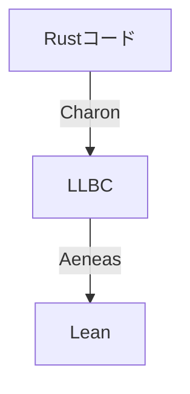

# はじめに

[Aeneas](https://github.com/AeneasVerif/aeneas)はRustプログラムを検証するためのツールチェインです。
[Charon](https://github.com/AeneasVerif/charon)がRustコードをLLBCと呼ばれる形式に変換してくれて、それをAeneasに読ませるとF*, Coq, HOL4, LEANのコードに変換してくれます。

筆者はLean初心者ですが、今回は実際にRustコードをLeanで検証してみようと思います。



# AeneasのRustモデル

AeneasのLeanコードではRustの式を評価した結果として以下が定義されています

```lean
inductive Error where
   | assertionFailure: Error -- assertion失敗
   | integerOverflow: Error -- オーバーフロー 特にリリースビルドではチェックされないやつ
   | divisionByZero: Error -- 0除算
   | arrayOutOfBounds: Error -- 配列の範囲外を参照した
   | maximumSizeExceeded: Error -- 配列のサイズがusizeを超えた
   | panic: Error -- パニック
   | undef: Error -- 未定義
deriving Repr, BEq

open Error

inductive Result (α : Type u) where
  | ok (v: α): Result α -- 成功
  | fail (e: Error): Result α -- それ以外
  | div -- これはNonemptyクラスを実装するためだけのやつだと思うので無視
deriving Repr, BEq
```

例えば、ある関数が(ある状況下で)必ず成功することとかが証明できればうれしそう

# やってみる

実際になにか証明してみます

適当にRustプロジェクトを作ります
```sh
cargo new sandbox
```

適当に関数を定義します

```rust:main.rs
pub fn add(a: i32, b: i32) -> i32 {
    a + b
}
```

CharonでLLBCに変換します

```sh
charon cargo --preset=aeneas
```

これで`sanbox.llbc`ができます。
LLBC自体はJSONですが中身は人用ではないのでよくわかりません。

aeneasでLeanに変換します

```sh
aeneas -backend lean sandbox.llbc
```

これでRustプログラムをLeanに変換したやつができます

```lean:Sandbox.lean
-- THIS FILE WAS AUTOMATICALLY GENERATED BY AENEAS
-- [sandbox]
import Aeneas
open Aeneas.Std Result Error
set_option linter.dupNamespace false
set_option linter.hashCommand false
set_option linter.unusedVariables false

namespace sandbox

/- [sandbox::main]:
   Source: 'src/main.rs', lines 1:0-1:12 -/
def main : Result Unit :=
  ok ()

/- [sandbox::add]:
   Source: 'src/main.rs', lines 3:0-5:1 -/
def add (a : I32) (b : I32) : Result I32 :=
  a + b
```

あとは適当にLeanプロジェクトを作ってAeneasのライブラリを追加して好きにするだけです。

```lean:Basic.lean
import Aeneas
import RustVerify.Sandbox

open Aeneas.Std Result Error

theorem add_spec {a b : I32} (h₀ : I32.min ≤ ↑a + ↑b) (h₁ : ↑a + ↑b ≤ I32.max) :
  ∃ c, sandbox.add a b = ok c ∧ (↑c: ℤ) = ↑a + ↑b := by
  unfold sandbox.add
  apply I32.add_spec h₀ h₁
```

aはI32なのでa + bはResult I32ですが↑aはaの中身の整数型なので↑a + ↑bはLeanの整数型です

I32.min ≤ ↑a + ↑b かつ ↑a + ↑b ≤ I32.max なら

```rust
pub fn add(a: i32, b: i32) -> i32 {
    a + b
}
```
は常に成功してそのとき返り値は↑a + ↑bということを表しています

これだとあたりまえ体操すぎるのでもうちょっと頑張ってみます

# 自分のPCG関数が常に成功することを証明してみる

筆者は速い乱数が欲しいときによくPCGの`Pcg64Si`を書くのですがそれをやってみます。

https://github.com/hatoo/oha/blob/a0002913331784299102d6dfe6d469ff7e4db2d5/src/pcg64si.rs#L1-L31

`rand::RngCore`とかを使うとCharonが文句をいうので興味がある部分だけ抜き出します

```rust
#[repr(transparent)]
pub struct Pcg64Si {
    state: u64,
}

impl Pcg64Si {
    pub fn next_u64(&mut self) -> u64 {
        let old_state = self.state;
        self.state = self
            .state
            .wrapping_mul(6364136223846793005)
            .wrapping_add(1442695040888963407);

        let word =
            ((old_state >> ((old_state >> 59) + 5)) ^ old_state).wrapping_mul(12605985483714917081);
        (word >> 43) ^ word
    }
}
```

Aeneasの結果がこちら。割とわかりやすい

```lean:Sandbox.lean
/- [sandbox::{sandbox::Pcg64Si}::next_u64]:
   Source: 'src/main.rs', lines 13:4-23:5 -/
def Pcg64Si.next_u64 (self : Pcg64Si) : Result (U64 × Pcg64Si) :=
  do
  let i ←
    (↑(core.num.U64.wrapping_mul self.state 6364136223846793005#u64) : Result
      U64)
  let i1 ←
    (↑(core.num.U64.wrapping_add i 1442695040888963407#u64) : Result U64)
  let i2 ← self.state >>> 59#i32
  let i3 ← i2 + 5#u64
  let i4 ← self.state >>> i3
  let i5 ← (↑(i4 ^^^ self.state) : Result U64)
  let word ←
    (↑(core.num.U64.wrapping_mul i5 12605985483714917081#u64) : Result U64)
  let i6 ← word >>> 43#i32
  let i7 ← (↑(i6 ^^^ word) : Result U64)
  ok (i7, { state := i1 })
```

```lean:Basic.lean
@[progress]
theorem UScalar.xor_spec {ty} (x y : UScalar ty) :
  ∃ z, toResult (x ^^^ y) = ok z ∧ z.val = (x ^^^ y).val ∧ z.bv = x.bv ^^^ y.bv := by
  simp [toResult]
  rfl

theorem Pcg64Si.next_u64_no_panic (self : sandbox.Pcg64Si) :
  ∃ res : U64 × sandbox.Pcg64Si, self.next_u64 = ok res := by
  unfold sandbox.Pcg64Si.next_u64
  progress*
```

`self.next_u64()`は必ず成功する

## ちょっとLean

`progress` tacticは`progress` attributeがついた

```lean
theorem thm_name (arg1 : ty1) ... (argn : tyn)
  (h_pre1 : precondition_1) ... (h_prem : precondition_m) :
  ∃ (res1 : res_ty1) ... (resk : res_tyk),
    f arg1 ... argn = ok res1 ∧ postcondition_1 ∧ ... ∧ postcondition_k
```

みたいなtheoremから使えそうなやつを探してゴールのモナドを進めてくれます

`progress*`は`progress`を反復してやってくれます

この例では`xor`のためのprogress attributeのついたtheoremがまだライブラリになかったので追加で定義しています