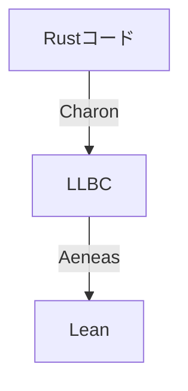

# はじめに

[Aeneas](https://github.com/AeneasVerif/aeneas)はRustプログラムを検証するためのツールチェインです。
[Charon](https://github.com/AeneasVerif/charon)がRustコードをLLBCと呼ばれる形式に変換してくれて、それをAeneasに読ませるとF*, Coq, HOL4, LEANのコードに変換してくれます。

筆者はLean初心者ですが、今回は実際にRustコードをLeanで検証してみようと思います。



# AeneasのRustモデル

AeneasのLeanコードではRustの式を評価した結果として以下が定義されています

```lean
inductive Error where
   | assertionFailure: Error -- assertion失敗
   | integerOverflow: Error -- オーバーフロー 特にリリースビルドではチェックされないやつ
   | divisionByZero: Error -- 0除算
   | arrayOutOfBounds: Error -- 配列の範囲外を参照した
   | maximumSizeExceeded: Error -- 配列のサイズがusizeを超えた
   | panic: Error -- パニック
   | undef: Error -- 未定義
deriving Repr, BEq

open Error

inductive Result (α : Type u) where
  | ok (v: α): Result α -- 成功
  | fail (e: Error): Result α -- それ以外
  | div -- これはNonemptyクラスを実装するためだけのやつだと思うので無視
deriving Repr, BEq
```

例えば、ある関数が(ある状況下で)必ず成功することとかが証明できればうれしそう

# やってみる

実際になにか証明してみます

適当にRustプロジェクトを作ります
```sh
cargo new sandbox
```

適当に関数を定義します

```rust:main.rs
pub fn add(a: i32, b: i32) -> i32 {
    a + b
}
```

CharonでLLBCに変換します

```sh
charon cargo --preset=aeneas
```

これで`sanbox.llbc`ができます。
LLBC自体はJSONですが中身は人用ではないのでよくわかりません。

aeneasでLeanに変換します

```sh
aeneas -backend lean sandbox.llbc
```

これでRustプログラムをLeanに変換したやつができます

```lean
-- THIS FILE WAS AUTOMATICALLY GENERATED BY AENEAS
-- [sandbox]
import Aeneas
open Aeneas.Std Result Error
set_option linter.dupNamespace false
set_option linter.hashCommand false
set_option linter.unusedVariables false

namespace sandbox

/- [sandbox::main]:
   Source: 'src/main.rs', lines 1:0-1:12 -/
def main : Result Unit :=
  ok ()

/- [sandbox::add]:
   Source: 'src/main.rs', lines 3:0-5:1 -/
def add (a : I32) (b : I32) : Result I32 :=
  a + b
```

あとは適当にLeanプロジェクトを作ってAeneasのライブラリを追加して好きにするだけです。
