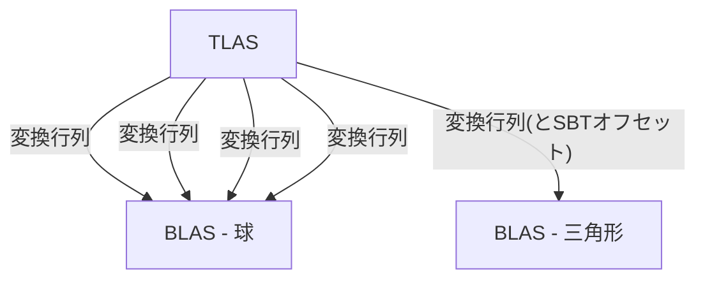

前章まででVKRで球を描いていきましたが、もうすこしVKRに慣れるために追加で三角形も描画していきます。
SBTの機能を使うことで、球を描く用のシェーダー、三角形を描く用のシェーダーを動的に切り替えることができます。



今までのraytracing-exampleをコピーしてraytracing-example-plusとして続けていきます。
コードは[こちら](https://github.com/hatoo/zenn-content/tree/master/raytracing-example-plus)。

# 三角形用のClosest-Hit Shaderを書く

三角形の当たり判定は標準で用意されているため、Closest-Hit Shaderだけ書けばよいです。
レイと三角形との衝突座標は`#[spirv(hit_attribute)]`から計算できます。

```rust:shader/src/lib.rs
#[derive(Copy, Clone)]
#[repr(C)]
pub struct Vertex {
    pub position: Vec3A,
    pub normal: Vec3A,
}

#[spirv(closest_hit)]
pub fn triangle_closest_hit(
    #[spirv(hit_attribute)] attribute: &Vec2,
    #[spirv(object_to_world)] object_to_world: Affine3,
    #[spirv(world_to_object)] world_to_object: Affine3,
    #[spirv(world_ray_direction)] world_ray_direction: Vec3A,
    // 各頂点の情報
    // あらかじめ用意しておく
    #[spirv(storage_buffer, descriptor_set = 0, binding = 3)] vertices: &[Vertex],
    // 各面のindex
    // あらかじめ用意しておく
    #[spirv(storage_buffer, descriptor_set = 0, binding = 4)] indices: &[u32],
    #[spirv(incoming_ray_payload)] out: &mut RayPayload,
    // 面の番号
    #[spirv(primitive_id)] primitive_id: u32,
    #[spirv(instance_custom_index)] instance_custom_index: u32,
) {
    // 各頂点の座標
    let v0 = *unsafe {
        vertices.index_unchecked(*indices.index_unchecked(3 * primitive_id as usize + 0) as usize)
    };
    let v1 = *unsafe {
        vertices.index_unchecked(*indices.index_unchecked(3 * primitive_id as usize + 1) as usize)
    };
    let v2 = *unsafe {
        vertices.index_unchecked(*indices.index_unchecked(3 * primitive_id as usize + 2) as usize)
    };

    let barycentrics = vec3a(1.0 - attribute.x - attribute.y, attribute.x, attribute.y);

    // 衝突箇所は`hit_attribute`から求められる
    let pos =
        v0.position * barycentrics.x + v1.position * barycentrics.y + v2.position * barycentrics.z;

    // 法線
    let nrm = v0.normal * barycentrics.x + v1.normal * barycentrics.y + v2.normal * barycentrics.z;

    // 座標変換
    // 参考 https://github.com/nvpro-samples/vk_raytracing_tutorial_KHR/blob/master/ray_tracing__simple/shaders/raytrace.rchit#L69-L75
    // 行列*ベクトルの演算をする簡単な関数はrust-gpuにはまだない
    // asm!(...)を使えば1命令でできそうだが簡単のために自力で計算している
    // とはいえGPUの個々のコアはSIMD演算をサポートしていないので仮にSPIR-Vの1命令で表現したとしても速度の向上は期待できない
    // SPIR-Vのサイズが減るだけ
    let hit_pos = pos.x * object_to_world.x
        + pos.y * object_to_world.y
        + pos.z * object_to_world.z
        + object_to_world.w;

    let normal = vec3a(
        world_to_object.x.dot(nrm),
        world_to_object.y.dot(nrm),
        world_to_object.z.dot(nrm),
    )
    .normalize();

    *out = RayPayload::new_hit(hit_pos, normal, world_ray_direction, instance_custom_index);
}
```

# BLASをつくる

三角形を保持したBLASを作ります。VKRの使い方に慣れたいだけなので三角形一個だけです。

```rust:src/main.rs
    let (bottom_as_triangle, bottom_as_triangle_buffer, vertex_buffer, index_buffer) = {
        // 頂点情報
        const VERTICES: [Vertex; 3] = [
            Vertex {
                position: const_vec3a!([1.0, -1.0, 0.0]),
                normal: const_vec3a!([0.0, 0.0, 1.0]),
            },
            Vertex {
                position: const_vec3a!([0.0, 1.0, 0.0]),
                normal: const_vec3a!([0.0, 0.0, 1.0]),
            },
            Vertex {
                position: const_vec3a!([-1.0, -1.0, 0.0]),
                normal: const_vec3a!([0.0, 0.0, 1.0]),
            },
        ];

        // インデックス
        const INDICES: [u32; 3] = [0, 1, 2];

        let vertex_stride = std::mem::size_of::<Vertex>();
        let vertex_buffer_size = vertex_stride * VERTICES.len();

        // Vertex用のバッファを作成。これはBLASの作成にも使うしシェーダーにも渡す。
        let mut vertex_buffer = BufferResource::new(
            vertex_buffer_size as vk::DeviceSize,
            vk::BufferUsageFlags::STORAGE_BUFFER
                | vk::BufferUsageFlags::SHADER_DEVICE_ADDRESS
                | vk::BufferUsageFlags::ACCELERATION_STRUCTURE_BUILD_INPUT_READ_ONLY_KHR,
            vk::MemoryPropertyFlags::HOST_VISIBLE | vk::MemoryPropertyFlags::HOST_COHERENT,
            &device,
            device_memory_properties,
        );

        vertex_buffer.store(&VERTICES, &device);

        // Index用のバッファを作成。これもBLASの作成にも使うしシェーダーにも渡す。
        let index_buffer_size = std::mem::size_of::<u32>() * INDICES.len();

        let mut index_buffer = BufferResource::new(
            index_buffer_size as vk::DeviceSize,
            vk::BufferUsageFlags::STORAGE_BUFFER
                | vk::BufferUsageFlags::SHADER_DEVICE_ADDRESS
                | vk::BufferUsageFlags::ACCELERATION_STRUCTURE_BUILD_INPUT_READ_ONLY_KHR,
            vk::MemoryPropertyFlags::HOST_VISIBLE | vk::MemoryPropertyFlags::HOST_COHERENT,
            &device,
            device_memory_properties,
        );

        index_buffer.store(&INDICES, &device);

        let geometry = vk::AccelerationStructureGeometryKHR::builder()
            .geometry_type(vk::GeometryTypeKHR::TRIANGLES)
            .geometry(vk::AccelerationStructureGeometryDataKHR {
                triangles: vk::AccelerationStructureGeometryTrianglesDataKHR::builder()
                    .vertex_data(vk::DeviceOrHostAddressConstKHR {
                        device_address: unsafe {
                            get_buffer_device_address(&device, vertex_buffer.buffer)
                        },
                    })
                    .max_vertex(VERTICES.len() as u32 - 1)
                    .vertex_stride(vertex_stride as u64)
                    .vertex_format(vk::Format::R32G32B32_SFLOAT)
                    .index_data(vk::DeviceOrHostAddressConstKHR {
                        device_address: unsafe {
                            get_buffer_device_address(&device, index_buffer.buffer)
                        },
                    })
                    .index_type(vk::IndexType::UINT32)
                    .build(),
            })
            .flags(vk::GeometryFlagsKHR::OPAQUE)
            .build();

        let build_range_info = vk::AccelerationStructureBuildRangeInfoKHR::builder()
            .first_vertex(0)
            .primitive_count(INDICES.len() as u32)
            .primitive_offset(0)
            .transform_offset(0)
            .build();

        let geometries = [geometry];

        let mut build_info = vk::AccelerationStructureBuildGeometryInfoKHR::builder()
            .flags(vk::BuildAccelerationStructureFlagsKHR::PREFER_FAST_TRACE)
            .geometries(&geometries)
            .mode(vk::BuildAccelerationStructureModeKHR::BUILD)
            .ty(vk::AccelerationStructureTypeKHR::BOTTOM_LEVEL)
            .build();

        let size_info = unsafe {
            acceleration_structure.get_acceleration_structure_build_sizes(
                vk::AccelerationStructureBuildTypeKHR::DEVICE,
                &build_info,
                &[1],
            )
        };

        let bottom_as_buffer = BufferResource::new(
            size_info.acceleration_structure_size,
            vk::BufferUsageFlags::ACCELERATION_STRUCTURE_STORAGE_KHR
                | vk::BufferUsageFlags::SHADER_DEVICE_ADDRESS
                | vk::BufferUsageFlags::STORAGE_BUFFER,
            vk::MemoryPropertyFlags::DEVICE_LOCAL,
            &device,
            device_memory_properties,
        );

        let as_create_info = vk::AccelerationStructureCreateInfoKHR::builder()
            .ty(build_info.ty)
            .size(size_info.acceleration_structure_size)
            .buffer(bottom_as_buffer.buffer)
            .offset(0)
            .build();

        let bottom_as =
            unsafe { acceleration_structure.create_acceleration_structure(&as_create_info, None) }
                .unwrap();

        build_info.dst_acceleration_structure = bottom_as;

        let scratch_buffer = BufferResource::new(
            size_info.build_scratch_size,
            vk::BufferUsageFlags::SHADER_DEVICE_ADDRESS | vk::BufferUsageFlags::STORAGE_BUFFER,
            vk::MemoryPropertyFlags::DEVICE_LOCAL,
            &device,
            device_memory_properties,
        );

        build_info.scratch_data = vk::DeviceOrHostAddressKHR {
            device_address: unsafe { get_buffer_device_address(&device, scratch_buffer.buffer) },
        };

        let build_command_buffer = {
            let allocate_info = vk::CommandBufferAllocateInfo::builder()
                .command_buffer_count(1)
                .command_pool(command_pool)
                .level(vk::CommandBufferLevel::PRIMARY)
                .build();

            let command_buffers =
                unsafe { device.allocate_command_buffers(&allocate_info) }.unwrap();
            command_buffers[0]
        };

        unsafe {
            device
                .begin_command_buffer(
                    build_command_buffer,
                    &vk::CommandBufferBeginInfo::builder()
                        .flags(vk::CommandBufferUsageFlags::ONE_TIME_SUBMIT)
                        .build(),
                )
                .unwrap();

            let build_infos = [build_info];
            let build_range_infos: &[&[_]] = &[&[build_range_info]];

            acceleration_structure.cmd_build_acceleration_structures(
                build_command_buffer,
                &build_infos,
                build_range_infos,
            );
            device.end_command_buffer(build_command_buffer).unwrap();
            device
                .queue_submit(
                    graphics_queue,
                    &[vk::SubmitInfo::builder()
                        .command_buffers(&[build_command_buffer])
                        .build()],
                    vk::Fence::null(),
                )
                .expect("queue submit failed.");

            device.queue_wait_idle(graphics_queue).unwrap();
            device.free_command_buffers(command_pool, &[build_command_buffer]);
            scratch_buffer.destroy(&device);
        }
        (bottom_as, bottom_as_buffer, vertex_buffer, index_buffer)
    };
```

# TLASにBLASを配置する

```rust:src/main.rs
fn sample_scene(
    sphere_accel_handle: u64,
    // 三角形のBLASのハンドル
    triangle_accel_handle: u64,
) -> (
    Vec<vk::AccelerationStructureInstanceKHR>,
    Vec<EnumMaterialPod>,
) {
    // ...

    world.push((
        vk::AccelerationStructureInstanceKHR {
            transform: vk::TransformMatrixKHR {
                matrix: [4.0, 0.0, 0.0, 0.0, 0.0, 1.0, 0.0, 1.0, 0.0, 0.0, 1.0, 1.2],
            },
            instance_custom_index_and_mask: 0xff << 24,
                // 球とは違うシェーダーが動いてほしいのでオフセットを設定している
            instance_shader_binding_table_record_offset_and_flags: vk::Packed24_8::new(
                1,
                vk::GeometryInstanceFlagsKHR::TRIANGLE_FACING_CULL_DISABLE.as_raw() as u8,
            ),
            acceleration_structure_reference: vk::AccelerationStructureReferenceKHR {
                device_handle: triangle_accel_handle,
            },
        },
        EnumMaterialPod::new_metal(vec3a(0.7, 0.6, 0.5), 0.0),
    ));

    // ...
}
```

# 動かす

あとはDescriptorにVertexとIndexバッファーを追加して、SBTでHit Record二個分の領域を確保するだけです。


# Any-Hit Shaderを実装してみる

せっかくなのでAny-Hit Shaderを実装してみます。
Any-Hit Shaderではレイの衝突をなかったことにできます。
衝突をなくしたいときに`ignore_intersection`を呼ぶだけです。

```rust:shader/src/lib.rs
#[spirv(any_hit)]
pub fn triangle_any_hit(
    #[spirv(ray_tmax)] t: f32,
    #[spirv(object_ray_origin)] object_ray_origin: Vec3A,
    #[spirv(object_ray_direction)] object_ray_direction: Vec3A,
) {
    let pos = object_ray_origin + t * object_ray_direction;

    // 中心から一定距離の衝突をなかったことにする
    if pos.length_squared() < 0.2 {
        unsafe { ignore_intersection() };
    }
}
```

## 動かす

三角形のHit GroupにAny-Hit Shaderを設定するだけです。また、所々で設定した`OPAQUE`設定をなくしましょう。


