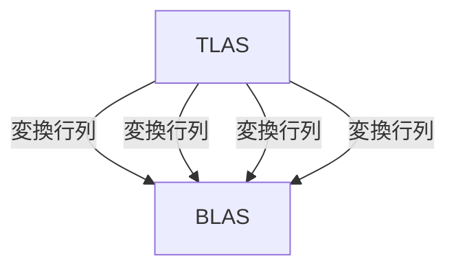

シェーダーが完成したので動かすプログラムをashで書いていきます。
コードは[こちら](https://github.com/hatoo/zenn-content/tree/master/raytracing-example)にあります。

# GPUバッファ用の便利structをつくる

この章ではGPUのメモリ確保を多く扱うためそれようの便利structを作ります

```rust:src/main.rs
#[derive(Clone)]
struct BufferResource {
    buffer: vk::Buffer,
    memory: vk::DeviceMemory,
    size: vk::DeviceSize,
}

impl BufferResource {
    fn new(
        size: vk::DeviceSize,
        usage: vk::BufferUsageFlags,
        memory_properties: vk::MemoryPropertyFlags,
        device: &ash::Device,
        device_memory_properties: vk::PhysicalDeviceMemoryProperties,
    ) -> Self {
        unsafe {
            let buffer_info = vk::BufferCreateInfo::builder()
                .size(size)
                .usage(usage)
                .sharing_mode(vk::SharingMode::EXCLUSIVE)
                .build();

            let buffer = device.create_buffer(&buffer_info, None).unwrap();

            let memory_req = device.get_buffer_memory_requirements(buffer);

            let memory_index = get_memory_type_index(
                device_memory_properties,
                memory_req.memory_type_bits,
                memory_properties,
            );

            let mut memory_allocate_flags_info = vk::MemoryAllocateFlagsInfo::builder()
                .flags(vk::MemoryAllocateFlags::DEVICE_ADDRESS)
                .build();

            let mut allocate_info_builder = vk::MemoryAllocateInfo::builder();

            if usage.contains(vk::BufferUsageFlags::SHADER_DEVICE_ADDRESS) {
                // VKRは確保したメモリの物理アドレスが必要なAPIがあるので、ここで対応する。
                allocate_info_builder =
                    allocate_info_builder.push_next(&mut memory_allocate_flags_info);
            }

            let allocate_info = allocate_info_builder
                .allocation_size(memory_req.size)
                .memory_type_index(memory_index)
                .build();

            let memory = device.allocate_memory(&allocate_info, None).unwrap();

            device.bind_buffer_memory(buffer, memory, 0).unwrap();

            BufferResource {
                buffer,
                memory,
                size,
            }
        }
    }

    fn store<T: Copy>(&mut self, data: &[T], device: &ash::Device) {
        unsafe {
            let size = (std::mem::size_of::<T>() * data.len()) as u64;
            assert!(self.size >= size);
            let mapped_ptr = self.map(size, device);
            let mut mapped_slice = Align::new(mapped_ptr, std::mem::align_of::<T>() as u64, size);
            mapped_slice.copy_from_slice(&data);
            self.unmap(device);
        }
    }

    fn map(&mut self, size: vk::DeviceSize, device: &ash::Device) -> *mut std::ffi::c_void {
        unsafe {
            let data: *mut std::ffi::c_void = device
                .map_memory(self.memory, 0, size, vk::MemoryMapFlags::empty())
                .unwrap();
            data
        }
    }

    fn unmap(&mut self, device: &ash::Device) {
        unsafe {
            device.unmap_memory(self.memory);
        }
    }

    unsafe fn destroy(self, device: &ash::Device) {
        device.destroy_buffer(self.buffer, None);
        device.free_memory(self.memory, None);
    }
}
```

# BLASをつくる

BLASを作ります。この文章では1つのBLASをTLASで使いまわしていくのでAABBを一個持ったBLASを作ればよいです。
ASの構築時には追加でScratch Bufferが必要です。Vulkanが暗黙的にGPUのメモリを確保することはまずないのでこれも自分で確保する必要があります。



```rust:src/main.rs
    let acceleration_structure =
        ash::extensions::khr::AccelerationStructure::new(&instance, &device);
    // ...

    // Create bottom-level acceleration structure

    let (bottom_as_sphere, bottom_as_sphere_buffer, aabb_buffer) = {
        // 2.0^3のAABB一つあればよい
        let aabb = vk::AabbPositionsKHR::builder()
            .min_x(-1.0)
            .max_x(1.0)
            .min_y(-1.0)
            .max_y(1.0)
            .min_z(-1.0)
            .max_z(1.0)
            .build();

        // GPU用のAABBのバッファ
        let mut aabb_buffer = BufferResource::new(
            std::mem::size_of::<vk::AabbPositionsKHR>() as u64,
            vk::BufferUsageFlags::SHADER_DEVICE_ADDRESS
                | vk::BufferUsageFlags::ACCELERATION_STRUCTURE_BUILD_INPUT_READ_ONLY_KHR,
            vk::MemoryPropertyFlags::HOST_VISIBLE | vk::MemoryPropertyFlags::HOST_COHERENT,
            &device,
            device_memory_properties,
        );

        aabb_buffer.store(&[aabb], &device);

        let geometry = vk::AccelerationStructureGeometryKHR::builder()
            .geometry_type(vk::GeometryTypeKHR::AABBS)
            .geometry(vk::AccelerationStructureGeometryDataKHR {
                aabbs: vk::AccelerationStructureGeometryAabbsDataKHR::builder()
                    .data(vk::DeviceOrHostAddressConstKHR {
                        device_address: unsafe {
                            get_buffer_device_address(&device, aabb_buffer.buffer)
                        },
                    })
                    .stride(std::mem::size_of::<vk::AabbPositionsKHR>() as u64)
                    .build(),
            })
            // このBLASはAny-Hit Shaderを動かさない。ここでも設定できる。
            .flags(vk::GeometryFlagsKHR::OPAQUE)
            .build();

        let build_range_info = vk::AccelerationStructureBuildRangeInfoKHR::builder()
            .first_vertex(0)
            .primitive_count(1)
            .primitive_offset(0)
            .transform_offset(0)
            .build();

        let geometries = [geometry];

        let mut build_info = vk::AccelerationStructureBuildGeometryInfoKHR::builder()
            .flags(vk::BuildAccelerationStructureFlagsKHR::PREFER_FAST_TRACE)
            .geometries(&geometries)
            .mode(vk::BuildAccelerationStructureModeKHR::BUILD)
            .ty(vk::AccelerationStructureTypeKHR::BOTTOM_LEVEL)
            .build();

        // BLASとScratch Bufferで必要になるサイズを教えてもらう
        let size_info = unsafe {
            acceleration_structure.get_acceleration_structure_build_sizes(
                vk::AccelerationStructureBuildTypeKHR::DEVICE,
                &build_info,
                &[1],
            )
        };

        let bottom_as_buffer = BufferResource::new(
            size_info.acceleration_structure_size,
            vk::BufferUsageFlags::ACCELERATION_STRUCTURE_STORAGE_KHR
                | vk::BufferUsageFlags::SHADER_DEVICE_ADDRESS
                | vk::BufferUsageFlags::STORAGE_BUFFER,
            vk::MemoryPropertyFlags::DEVICE_LOCAL,
            &device,
            device_memory_properties,
        );

        let as_create_info = vk::AccelerationStructureCreateInfoKHR::builder()
            .ty(build_info.ty)
            .size(size_info.acceleration_structure_size)
            .buffer(bottom_as_buffer.buffer)
            .offset(0)
            .build();

        let bottom_as =
            unsafe { acceleration_structure.create_acceleration_structure(&as_create_info, None) }
                .unwrap();

        build_info.dst_acceleration_structure = bottom_as;

        let scratch_buffer = BufferResource::new(
            size_info.build_scratch_size,
            vk::BufferUsageFlags::SHADER_DEVICE_ADDRESS | vk::BufferUsageFlags::STORAGE_BUFFER,
            vk::MemoryPropertyFlags::DEVICE_LOCAL,
            &device,
            device_memory_properties,
        );

        build_info.scratch_data = vk::DeviceOrHostAddressKHR {
            device_address: unsafe { get_buffer_device_address(&device, scratch_buffer.buffer) },
        };

        let build_command_buffer = {
            let allocate_info = vk::CommandBufferAllocateInfo::builder()
                .command_buffer_count(1)
                .command_pool(command_pool)
                .level(vk::CommandBufferLevel::PRIMARY)
                .build();

            let command_buffers =
                unsafe { device.allocate_command_buffers(&allocate_info) }.unwrap();
            command_buffers[0]
        };

        unsafe {
            device
                .begin_command_buffer(
                    build_command_buffer,
                    &vk::CommandBufferBeginInfo::builder()
                        .flags(vk::CommandBufferUsageFlags::ONE_TIME_SUBMIT)
                        .build(),
                )
                .unwrap();

            let build_infos = [build_info];
            let build_range_infos: &[&[_]] = &[&[build_range_info]];

            // 前に書いたように、ASの構築もGPU上で行われる。リアルタイムなAPIなので当然か
            acceleration_structure.cmd_build_acceleration_structures(
                build_command_buffer,
                &build_infos,
                build_range_infos,
            );
            device.end_command_buffer(build_command_buffer).unwrap();
            device
                .queue_submit(
                    graphics_queue,
                    &[vk::SubmitInfo::builder()
                        .command_buffers(&[build_command_buffer])
                        .build()],
                    vk::Fence::null(),
                )
                .expect("queue submit failed.");

            device.queue_wait_idle(graphics_queue).unwrap();
            device.free_command_buffers(command_pool, &[build_command_buffer]);
            scratch_buffer.destroy(&device);
        }
        (bottom_as, bottom_as_buffer, aabb_buffer)
    };
```

# TLASをつくる

上でつくったBLASを参照するTLASをつくります。
まず、Ray Tracing in One Weekendと同じシーンを作ります。

```rust:src/main.rs
// 球一つ分のTLASのインスタンスを作る
fn create_sphere_instance(
    pos: glam::Vec3,
    size: f32,
    sphere_accel_handle: u64,
) -> vk::AccelerationStructureInstanceKHR {
    vk::AccelerationStructureInstanceKHR {
        transform: vk::TransformMatrixKHR {
            // 変換行列4x3
            matrix: [
                size, 0.0, 0.0, pos.x, 0.0, size, 0.0, pos.y, 0.0, 0.0, size, pos.z,
            ],
        },
        // MSBから8bit分がMask。これに`TraceRay`に指定したMaskがマッチしないと無視される。
        // のこり24bitがインスタンスのindex。これでマテリアルのindexを指定するが後で編集する。
        instance_custom_index_and_mask: 0xff << 24,
        // MASBから8bit分がフラグ。ここでもOPAQUEかどうか指定できる
        // のこりがSBTのオフセット。ここでは0
        instance_shader_binding_table_record_offset_and_flags:
            vk::GeometryInstanceFlagsKHR::FORCE_OPAQUE.as_raw() << 24 | 0,
        acceleration_structure_reference: vk::AccelerationStructureReferenceKHR {
            device_handle: sphere_accel_handle,
        },
    }
}

// TLASインスタンスとマテリアルをつくる
fn sample_scene(
    sphere_accel_handle: u64,
) -> (
    Vec<vk::AccelerationStructureInstanceKHR>,
    Vec<EnumMaterialPod>,
) {
    let mut rng = StdRng::from_entropy();
    let mut world = Vec::new();

    world.push((
        create_sphere_instance(vec3(0.0, -1000.0, 0.0), 1000.0, sphere_accel_handle),
        EnumMaterialPod::new_lambertian(vec3(0.5, 0.5, 0.5)),
    ));

    for a in -11..11 {
        for b in -11..11 {
            let center = vec3(
                a as f32 + 0.9 * rng.gen::<f32>(),
                0.2,
                b as f32 + 0.9 * rng.gen::<f32>(),
            );

            let choose_mat: f32 = rng.gen();

            if (center - vec3(4.0, 0.2, 0.0)).length() > 0.9 {
                match choose_mat {
                    x if x < 0.8 => {
                        let albedo = vec3(rng.gen(), rng.gen(), rng.gen())
                            * vec3(rng.gen(), rng.gen(), rng.gen());

                        world.push((
                            create_sphere_instance(center, 0.3, sphere_accel_handle),
                            EnumMaterialPod::new_lambertian(albedo),
                        ));
                    }
                    x if x < 0.95 => {
                        let albedo = vec3(
                            rng.gen_range(0.5..1.0),
                            rng.gen_range(0.5..1.0),
                            rng.gen_range(0.5..1.0),
                        );
                        let fuzz = rng.gen_range(0.0..0.5);

                        world.push((
                            create_sphere_instance(center, 0.2, sphere_accel_handle),
                            EnumMaterialPod::new_metal(albedo, fuzz),
                        ));
                    }
                    _ => world.push((
                        create_sphere_instance(center, 0.2, sphere_accel_handle),
                        EnumMaterialPod::new_dielectric(1.5),
                    )),
                }
            }
        }
    }

    world.push((
        create_sphere_instance(vec3(0.0, 1.0, 0.0), 1.0, sphere_accel_handle),
        EnumMaterialPod::new_dielectric(1.5),
    ));

    world.push((
        create_sphere_instance(vec3(-4.0, 1.0, 0.0), 1.0, sphere_accel_handle),
        EnumMaterialPod::new_lambertian(vec3(0.4, 0.2, 0.1)),
    ));

    world.push((
        create_sphere_instance(vec3(4.0, 1.0, 0.0), 1.0, sphere_accel_handle),
        EnumMaterialPod::new_metal(vec3(0.7, 0.6, 0.5), 0.0),
    ));

    let mut spheres = Vec::new();
    let mut materials = Vec::new();

    for (i, (mut sphere, material)) in world.into_iter().enumerate() {
        sphere.instance_custom_index_and_mask |= i as u32;
        spheres.push(sphere);
        materials.push(material);
    }

    (spheres, materials)
}
```