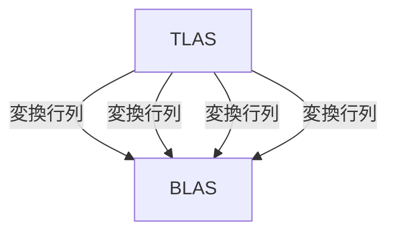

シェーダーが完成したので動かすプログラムをashで書いていきます。
コードは[こちら](https://github.com/hatoo/zenn-content/tree/master/raytracing-example)にあります。

# GPUバッファ用の便利structをつくる

この章ではGPUのメモリ確保を多く扱うためそれ用の便利structを作ります

```rust:src/main.rs
#[derive(Clone)]
struct BufferResource {
    buffer: vk::Buffer,
    memory: vk::DeviceMemory,
    size: vk::DeviceSize,
}

impl BufferResource {
    fn new(
        size: vk::DeviceSize,
        usage: vk::BufferUsageFlags,
        memory_properties: vk::MemoryPropertyFlags,
        device: &ash::Device,
        device_memory_properties: vk::PhysicalDeviceMemoryProperties,
    ) -> Self {
        unsafe {
            let buffer_info = vk::BufferCreateInfo::builder()
                .size(size)
                .usage(usage)
                .sharing_mode(vk::SharingMode::EXCLUSIVE)
                .build();

            let buffer = device.create_buffer(&buffer_info, None).unwrap();

            let memory_req = device.get_buffer_memory_requirements(buffer);

            let memory_index = get_memory_type_index(
                device_memory_properties,
                memory_req.memory_type_bits,
                memory_properties,
            );

            let mut memory_allocate_flags_info = vk::MemoryAllocateFlagsInfo::builder()
                .flags(vk::MemoryAllocateFlags::DEVICE_ADDRESS)
                .build();

            let mut allocate_info_builder = vk::MemoryAllocateInfo::builder();

            if usage.contains(vk::BufferUsageFlags::SHADER_DEVICE_ADDRESS) {
                // VKRは確保したメモリの物理アドレスが必要なAPIがあるので、ここで対応する。
                allocate_info_builder =
                    allocate_info_builder.push_next(&mut memory_allocate_flags_info);
            }

            let allocate_info = allocate_info_builder
                .allocation_size(memory_req.size)
                .memory_type_index(memory_index)
                .build();

            let memory = device.allocate_memory(&allocate_info, None).unwrap();

            device.bind_buffer_memory(buffer, memory, 0).unwrap();

            BufferResource {
                buffer,
                memory,
                size,
            }
        }
    }

    fn store<T: Copy>(&mut self, data: &[T], device: &ash::Device) {
        unsafe {
            let size = (std::mem::size_of::<T>() * data.len()) as u64;
            assert!(self.size >= size);
            let mapped_ptr = self.map(size, device);
            let mut mapped_slice = Align::new(mapped_ptr, std::mem::align_of::<T>() as u64, size);
            mapped_slice.copy_from_slice(&data);
            self.unmap(device);
        }
    }

    fn map(&mut self, size: vk::DeviceSize, device: &ash::Device) -> *mut std::ffi::c_void {
        unsafe {
            let data: *mut std::ffi::c_void = device
                .map_memory(self.memory, 0, size, vk::MemoryMapFlags::empty())
                .unwrap();
            data
        }
    }

    fn unmap(&mut self, device: &ash::Device) {
        unsafe {
            device.unmap_memory(self.memory);
        }
    }

    unsafe fn destroy(self, device: &ash::Device) {
        device.destroy_buffer(self.buffer, None);
        device.free_memory(self.memory, None);
    }
}
```

# BLASをつくる

BLASを作ります。この文章では1つのBLASをTLASで使いまわしていくのでAABBを一個持ったBLASを作ればよいです。
ASの構築時には追加でScratch Bufferが必要です。これはASの構築時のみに必要なメモリ領域です。どう使われるかはドライバの裁量ですが、例えばBVH構築時にソート処理が必要なのでそういうときには追加でメモリが必要なはずです。Vulkanが暗黙的にGPUのメモリを確保することはまずないのでこれも自分で確保する必要があります。



```rust:src/main.rs
    let acceleration_structure =
        ash::extensions::khr::AccelerationStructure::new(&instance, &device);
    // ...

    // Create bottom-level acceleration structure

    let (bottom_as_sphere, bottom_as_sphere_buffer, aabb_buffer) = {
        // 2.0^3のAABB一つあればよい
        let aabb = vk::AabbPositionsKHR::builder()
            .min_x(-1.0)
            .max_x(1.0)
            .min_y(-1.0)
            .max_y(1.0)
            .min_z(-1.0)
            .max_z(1.0)
            .build();

        // GPU用のAABBのバッファ
        let mut aabb_buffer = BufferResource::new(
            std::mem::size_of::<vk::AabbPositionsKHR>() as u64,
            vk::BufferUsageFlags::SHADER_DEVICE_ADDRESS
                | vk::BufferUsageFlags::ACCELERATION_STRUCTURE_BUILD_INPUT_READ_ONLY_KHR,
            vk::MemoryPropertyFlags::HOST_VISIBLE,
            &device,
            device_memory_properties,
        );

        aabb_buffer.store(&[aabb], &device);

        let geometry = vk::AccelerationStructureGeometryKHR::builder()
            .geometry_type(vk::GeometryTypeKHR::AABBS)
            .geometry(vk::AccelerationStructureGeometryDataKHR {
                aabbs: vk::AccelerationStructureGeometryAabbsDataKHR::builder()
                    .data(vk::DeviceOrHostAddressConstKHR {
                        device_address: unsafe {
                            get_buffer_device_address(&device, aabb_buffer.buffer)
                        },
                    })
                    .stride(std::mem::size_of::<vk::AabbPositionsKHR>() as u64)
                    .build(),
            })
            // このBLASはAny-Hit Shaderを動かさない。ここでも設定できる。
            .flags(vk::GeometryFlagsKHR::OPAQUE)
            .build();

        let build_range_info = vk::AccelerationStructureBuildRangeInfoKHR::builder()
            .first_vertex(0)
            .primitive_count(1)
            .primitive_offset(0)
            .transform_offset(0)
            .build();

        let geometries = [geometry];

        let mut build_info = vk::AccelerationStructureBuildGeometryInfoKHR::builder()
            // レイのトレースをしっかり最適化してビルドするか、最適化はほどほどにしてビルド時間を短く済ませるかなどを選べる
            // ここではTLASの構築は一回しか行わないので`PREFER_FAST_TRACE`でしっかり最適化してもらう
            .flags(vk::BuildAccelerationStructureFlagsKHR::PREFER_FAST_TRACE)
            .geometries(&geometries)
            .mode(vk::BuildAccelerationStructureModeKHR::BUILD)
            .ty(vk::AccelerationStructureTypeKHR::BOTTOM_LEVEL)
            .build();

        // BLASとScratch Bufferで必要になるサイズを教えてもらう
        // BLASのサイズは最大値なので実際にはこれより少なくなる可能性がありその場合は後でメモリ消費を抑えることができるが、面倒なので最大値で確保してそのまま
        let size_info = unsafe {
            acceleration_structure.get_acceleration_structure_build_sizes(
                vk::AccelerationStructureBuildTypeKHR::DEVICE,
                &build_info,
                &[1],
            )
        };

        let bottom_as_buffer = BufferResource::new(
            size_info.acceleration_structure_size,
            vk::BufferUsageFlags::ACCELERATION_STRUCTURE_STORAGE_KHR
                | vk::BufferUsageFlags::SHADER_DEVICE_ADDRESS
                | vk::BufferUsageFlags::STORAGE_BUFFER,
            vk::MemoryPropertyFlags::DEVICE_LOCAL,
            &device,
            device_memory_properties,
        );

        let as_create_info = vk::AccelerationStructureCreateInfoKHR::builder()
            .ty(build_info.ty)
            .size(size_info.acceleration_structure_size)
            .buffer(bottom_as_buffer.buffer)
            .offset(0)
            .build();

        let bottom_as =
            unsafe { acceleration_structure.create_acceleration_structure(&as_create_info, None) }
                .unwrap();

        build_info.dst_acceleration_structure = bottom_as;

        let scratch_buffer = BufferResource::new(
            size_info.build_scratch_size,
            vk::BufferUsageFlags::SHADER_DEVICE_ADDRESS | vk::BufferUsageFlags::STORAGE_BUFFER,
            vk::MemoryPropertyFlags::DEVICE_LOCAL,
            &device,
            device_memory_properties,
        );

        build_info.scratch_data = vk::DeviceOrHostAddressKHR {
            device_address: unsafe { get_buffer_device_address(&device, scratch_buffer.buffer) },
        };

        let build_command_buffer = {
            let allocate_info = vk::CommandBufferAllocateInfo::builder()
                .command_buffer_count(1)
                .command_pool(command_pool)
                .level(vk::CommandBufferLevel::PRIMARY)
                .build();

            let command_buffers =
                unsafe { device.allocate_command_buffers(&allocate_info) }.unwrap();
            command_buffers[0]
        };

        unsafe {
            device
                .begin_command_buffer(
                    build_command_buffer,
                    &vk::CommandBufferBeginInfo::builder()
                        .flags(vk::CommandBufferUsageFlags::ONE_TIME_SUBMIT)
                        .build(),
                )
                .unwrap();

            let build_infos = [build_info];
            let build_range_infos: &[&[_]] = &[&[build_range_info]];

            // 前に書いたように、ASの構築もGPU上で行われる。リアルタイムなAPIなので当然か
            acceleration_structure.cmd_build_acceleration_structures(
                build_command_buffer,
                &build_infos,
                build_range_infos,
            );
            device.end_command_buffer(build_command_buffer).unwrap();
            device
                .queue_submit(
                    graphics_queue,
                    &[vk::SubmitInfo::builder()
                        .command_buffers(&[build_command_buffer])
                        .build()],
                    vk::Fence::null(),
                )
                .expect("queue submit failed.");

            device.queue_wait_idle(graphics_queue).unwrap();
            device.free_command_buffers(command_pool, &[build_command_buffer]);
            scratch_buffer.destroy(&device);
        }
        (bottom_as, bottom_as_buffer, aabb_buffer)
    };
```

# TLASをつくる

上でつくったBLASを参照するTLASとマテリアルをつくります。
今回は、Ray Tracing in One Weekendと同じシーンをつくります。

```rust:src/main.rs
// 球一つ分のTLASのインスタンスを作る
fn create_sphere_instance(
    pos: glam::Vec3,
    size: f32,
    sphere_accel_handle: u64,
) -> vk::AccelerationStructureInstanceKHR {
    vk::AccelerationStructureInstanceKHR {
        transform: vk::TransformMatrixKHR {
            // 変換行列3x4
            matrix: [
                size, 0.0, 0.0, pos.x, 0.0, size, 0.0, pos.y, 0.0, 0.0, size, pos.z,
            ],
        },
        // MSBから8bit分がMask。これに`TraceRay`に指定したMaskがマッチしないと無視される。
        // のこり24bitがインスタンスのindex。これでマテリアルのindexを指定するが後で編集する。
        instance_custom_index_and_mask: 0xff << 24,
        // MSBから8bit分がフラグ。ここでもOPAQUEかどうか指定できる
        // のこりがSBTのオフセット。ここでは0
        instance_shader_binding_table_record_offset_and_flags:
            vk::GeometryInstanceFlagsKHR::FORCE_OPAQUE.as_raw() << 24 | 0,
        acceleration_structure_reference: vk::AccelerationStructureReferenceKHR {
            device_handle: sphere_accel_handle,
        },
    }
}

// TLASインスタンスとマテリアルをつくる
// Ray Tracing in One Weekendそのまま
fn sample_scene(
    sphere_accel_handle: u64,
) -> (
    Vec<vk::AccelerationStructureInstanceKHR>,
    Vec<EnumMaterialPod>,
) {
    let mut rng = StdRng::from_entropy();
    let mut world = Vec::new();

    world.push((
        create_sphere_instance(vec3(0.0, -1000.0, 0.0), 1000.0, sphere_accel_handle),
        EnumMaterialPod::new_lambertian(vec3(0.5, 0.5, 0.5)),
    ));

    for a in -11..11 {
        for b in -11..11 {
            let center = vec3(
                a as f32 + 0.9 * rng.gen::<f32>(),
                0.2,
                b as f32 + 0.9 * rng.gen::<f32>(),
            );

            let choose_mat: f32 = rng.gen();

            if (center - vec3(4.0, 0.2, 0.0)).length() > 0.9 {
                match choose_mat {
                    x if x < 0.8 => {
                        let albedo = vec3(rng.gen(), rng.gen(), rng.gen())
                            * vec3(rng.gen(), rng.gen(), rng.gen());

                        world.push((
                            create_sphere_instance(center, 0.3, sphere_accel_handle),
                            EnumMaterialPod::new_lambertian(albedo),
                        ));
                    }
                    x if x < 0.95 => {
                        let albedo = vec3(
                            rng.gen_range(0.5..1.0),
                            rng.gen_range(0.5..1.0),
                            rng.gen_range(0.5..1.0),
                        );
                        let fuzz = rng.gen_range(0.0..0.5);

                        world.push((
                            create_sphere_instance(center, 0.2, sphere_accel_handle),
                            EnumMaterialPod::new_metal(albedo, fuzz),
                        ));
                    }
                    _ => world.push((
                        create_sphere_instance(center, 0.2, sphere_accel_handle),
                        EnumMaterialPod::new_dielectric(1.5),
                    )),
                }
            }
        }
    }

    world.push((
        create_sphere_instance(vec3(0.0, 1.0, 0.0), 1.0, sphere_accel_handle),
        EnumMaterialPod::new_dielectric(1.5),
    ));

    world.push((
        create_sphere_instance(vec3(-4.0, 1.0, 0.0), 1.0, sphere_accel_handle),
        EnumMaterialPod::new_lambertian(vec3(0.4, 0.2, 0.1)),
    ));

    world.push((
        create_sphere_instance(vec3(4.0, 1.0, 0.0), 1.0, sphere_accel_handle),
        EnumMaterialPod::new_metal(vec3(0.7, 0.6, 0.5), 0.0),
    ));

    let mut spheres = Vec::new();
    let mut materials = Vec::new();

    for (i, (mut sphere, material)) in world.into_iter().enumerate() {
        sphere.instance_custom_index_and_mask |= i as u32;
        spheres.push(sphere);
        materials.push(material);
    }

    (spheres, materials)
}
```

 TLASをつくる

 ```rust:src/main.rs
    let sphere_accel_handle = {
        let as_addr_info = vk::AccelerationStructureDeviceAddressInfoKHR::builder()
            .acceleration_structure(bottom_as_sphere)
            .build();
        unsafe { acceleration_structure.get_acceleration_structure_device_address(&as_addr_info) }
    };

    let (sphere_instances, materials) = sample_scene(sphere_accel_handle);

    // 上でつくったTLASのインスタンス達をそのままGPUに入れる
    let (instance_count, instance_buffer) = {
        let instances = sphere_instances;

        let instance_buffer_size =
            std::mem::size_of::<vk::AccelerationStructureInstanceKHR>() * instances.len();

        let mut instance_buffer = BufferResource::new(
            instance_buffer_size as vk::DeviceSize,
            vk::BufferUsageFlags::SHADER_DEVICE_ADDRESS
                | vk::BufferUsageFlags::ACCELERATION_STRUCTURE_BUILD_INPUT_READ_ONLY_KHR,
            vk::MemoryPropertyFlags::HOST_VISIBLE,
            &device,
            device_memory_properties,
        );

        instance_buffer.store(&instances, &device);

        (instances.len(), instance_buffer)
    };

    // あとはBLASの作成とほぼ同じ
     let (top_as, top_as_buffer) = {
        let build_range_info = vk::AccelerationStructureBuildRangeInfoKHR::builder()
            .first_vertex(0)
            .primitive_count(instance_count as u32)
            .primitive_offset(0)
            .transform_offset(0)
            .build();

        let build_command_buffer = {
            let allocate_info = vk::CommandBufferAllocateInfo::builder()
                .command_buffer_count(1)
                .command_pool(command_pool)
                .level(vk::CommandBufferLevel::PRIMARY)
                .build();

            let command_buffers =
                unsafe { device.allocate_command_buffers(&allocate_info) }.unwrap();
            command_buffers[0]
        };

        unsafe {
            device
                .begin_command_buffer(
                    build_command_buffer,
                    &vk::CommandBufferBeginInfo::builder()
                        .flags(vk::CommandBufferUsageFlags::ONE_TIME_SUBMIT)
                        .build(),
                )
                .unwrap();
            let memory_barrier = vk::MemoryBarrier::builder()
                .src_access_mask(vk::AccessFlags::TRANSFER_WRITE)
                .dst_access_mask(vk::AccessFlags::ACCELERATION_STRUCTURE_WRITE_KHR)
                .build();
            device.cmd_pipeline_barrier(
                build_command_buffer,
                vk::PipelineStageFlags::TRANSFER,
                vk::PipelineStageFlags::ACCELERATION_STRUCTURE_BUILD_KHR,
                vk::DependencyFlags::empty(),
                &[memory_barrier],
                &[],
                &[],
            );
        }

        let instances = vk::AccelerationStructureGeometryInstancesDataKHR::builder()
            .array_of_pointers(false)
            .data(vk::DeviceOrHostAddressConstKHR {
                device_address: unsafe {
                    get_buffer_device_address(&device, instance_buffer.buffer)
                },
            })
            .build();

        let geometry = vk::AccelerationStructureGeometryKHR::builder()
            .geometry_type(vk::GeometryTypeKHR::INSTANCES)
            .geometry(vk::AccelerationStructureGeometryDataKHR { instances })
            .build();

        let geometries = [geometry];

        let mut build_info = vk::AccelerationStructureBuildGeometryInfoKHR::builder()
            .flags(vk::BuildAccelerationStructureFlagsKHR::PREFER_FAST_TRACE)
            .geometries(&geometries)
            .mode(vk::BuildAccelerationStructureModeKHR::BUILD)
            .ty(vk::AccelerationStructureTypeKHR::TOP_LEVEL)
            .build();

        let size_info = unsafe {
            acceleration_structure.get_acceleration_structure_build_sizes(
                vk::AccelerationStructureBuildTypeKHR::DEVICE,
                &build_info,
                &[build_range_info.primitive_count],
            )
        };

        // 自分の環境では
        // build_range_info.primitive_count = 484
        // size_info = AccelerationStructureBuildSizesInfoKHR {
        // s_type: ACCELERATION_STRUCTURE_BUILD_SIZES_INFO_KHR,
        // p_next: 0x0000000000000000,
        // acceleration_structure_size: 241920,
        // update_scratch_size: 0,
        // build_scratch_size: 74368,
        // }
        // でした

        let top_as_buffer = BufferResource::new(
            size_info.acceleration_structure_size,
            vk::BufferUsageFlags::ACCELERATION_STRUCTURE_STORAGE_KHR
                | vk::BufferUsageFlags::SHADER_DEVICE_ADDRESS
                | vk::BufferUsageFlags::STORAGE_BUFFER,
            vk::MemoryPropertyFlags::DEVICE_LOCAL,
            &device,
            device_memory_properties,
        );

        let as_create_info = vk::AccelerationStructureCreateInfoKHR::builder()
            .ty(build_info.ty)
            .size(size_info.acceleration_structure_size)
            .buffer(top_as_buffer.buffer)
            .offset(0)
            .build();

        let top_as =
            unsafe { acceleration_structure.create_acceleration_structure(&as_create_info, None) }
                .unwrap();

        build_info.dst_acceleration_structure = top_as;

        let scratch_buffer = BufferResource::new(
            size_info.build_scratch_size,
            vk::BufferUsageFlags::SHADER_DEVICE_ADDRESS | vk::BufferUsageFlags::STORAGE_BUFFER,
            vk::MemoryPropertyFlags::DEVICE_LOCAL,
            &device,
            device_memory_properties,
        );

        build_info.scratch_data = vk::DeviceOrHostAddressKHR {
            device_address: unsafe { get_buffer_device_address(&device, scratch_buffer.buffer) },
        };

        unsafe {
            let build_infos = [build_info];
            let build_range_infos: &[&[_]] = &[&[build_range_info]];
            acceleration_structure.cmd_build_acceleration_structures(
                build_command_buffer,
                &build_infos,
                build_range_infos,
            );
            device.end_command_buffer(build_command_buffer).unwrap();
            device
                .queue_submit(
                    graphics_queue,
                    &[vk::SubmitInfo::builder()
                        .command_buffers(&[build_command_buffer])
                        .build()],
                    vk::Fence::null(),
                )
                .expect("queue submit failed.");

            device.queue_wait_idle(graphics_queue).unwrap();
            device.free_command_buffers(command_pool, &[build_command_buffer]);
            scratch_buffer.destroy(&device);
        }

        (top_as, top_as_buffer)
    };
 ```

 マテリアルのリストもつくったのでGPUに入れておきます

 ```rust:src/main.rs
    let material_buffer = {
        let buffer_size = bytemuck::cast_slice::<_, u8>(&materials).len() as vk::DeviceSize;

        let mut material_buffer = BufferResource::new(
            buffer_size,
            vk::BufferUsageFlags::STORAGE_BUFFER,
            vk::MemoryPropertyFlags::HOST_VISIBLE,
            &device,
            device_memory_properties,
        );
        material_buffer.store(&materials, &device);

        material_buffer
    };
```

# レイトレーシングパイプラインをつくる

RaytracingPipelineはレイトレーシング用のGraphicsPipelineのようなものです。
ここで各シェーダーを登録し、DescriptorSet、Push Constantの情報も教えてあげます。

```rust:src/main.rs
    let (descriptor_set_layout, graphics_pipeline, pipeline_layout, shader_groups_len) = {
        let binding_flags_inner = [
            vk::DescriptorBindingFlagsEXT::empty(),
            vk::DescriptorBindingFlagsEXT::empty(),
            vk::DescriptorBindingFlagsEXT::empty(),
        ];

        let mut binding_flags = vk::DescriptorSetLayoutBindingFlagsCreateInfoEXT::builder()
            .binding_flags(&binding_flags_inner)
            .build();

        let descriptor_set_layout = unsafe {
            device.create_descriptor_set_layout(
                &vk::DescriptorSetLayoutCreateInfo::builder()
                    .bindings(&[
                        // descriptor_set = 0, binding = 0
                        // TLAS
                        vk::DescriptorSetLayoutBinding::builder()
                            .descriptor_count(1)
                            .descriptor_type(vk::DescriptorType::ACCELERATION_STRUCTURE_KHR)
                            .stage_flags(vk::ShaderStageFlags::RAYGEN_KHR)
                            .binding(0)
                            .build(),
                        // descriptor_set = 0, binding = 1
                        // 出力画像
                        vk::DescriptorSetLayoutBinding::builder()
                            .descriptor_count(1)
                            .descriptor_type(vk::DescriptorType::STORAGE_IMAGE)
                            .stage_flags(vk::ShaderStageFlags::RAYGEN_KHR)
                            .binding(1)
                            .build(),
                        // descriptor_set = 0, binding = 2
                        // マテリアル
                        vk::DescriptorSetLayoutBinding::builder()
                            .descriptor_count(1)
                            .descriptor_type(vk::DescriptorType::STORAGE_BUFFER)
                            .stage_flags(vk::ShaderStageFlags::RAYGEN_KHR)
                            .binding(2)
                            .build(),
                    ])
                    .push_next(&mut binding_flags)
                    .build(),
                None,
            )
        }
        .unwrap();

        // Push Constantはホストから渡す乱数の4byte
        let push_constant_range = vk::PushConstantRange::builder()
            .offset(0)
            .size(4)
            .stage_flags(vk::ShaderStageFlags::RAYGEN_KHR)
            .build();

        const SHADER: &[u8] = include_bytes!(env!("shader.spv"));

        let shader_module = unsafe { create_shader_module(&device, SHADER).unwrap() };

        let layouts = [descriptor_set_layout];
        let layout_create_info = vk::PipelineLayoutCreateInfo::builder()
            .set_layouts(&layouts)
            .push_constant_ranges(&[push_constant_range])
            .build();

        let pipeline_layout =
            unsafe { device.create_pipeline_layout(&layout_create_info, None) }.unwrap();

        let shader_groups = vec![
            // group0 = [ raygen ]
            vk::RayTracingShaderGroupCreateInfoKHR::builder()
                .ty(vk::RayTracingShaderGroupTypeKHR::GENERAL)
                .general_shader(0)
                .closest_hit_shader(vk::SHADER_UNUSED_KHR)
                .any_hit_shader(vk::SHADER_UNUSED_KHR)
                .intersection_shader(vk::SHADER_UNUSED_KHR)
                .build(),
            // group1 = [ miss ]
            vk::RayTracingShaderGroupCreateInfoKHR::builder()
                .ty(vk::RayTracingShaderGroupTypeKHR::GENERAL)
                .general_shader(1)
                .closest_hit_shader(vk::SHADER_UNUSED_KHR)
                .any_hit_shader(vk::SHADER_UNUSED_KHR)
                .intersection_shader(vk::SHADER_UNUSED_KHR)
                .build(),
            // group2 = [ chit ]
            vk::RayTracingShaderGroupCreateInfoKHR::builder()
                .ty(vk::RayTracingShaderGroupTypeKHR::PROCEDURAL_HIT_GROUP)
                .general_shader(vk::SHADER_UNUSED_KHR)
                .closest_hit_shader(3)
                .any_hit_shader(vk::SHADER_UNUSED_KHR)
                .intersection_shader(2)
                .build(),
        ];

        let shader_stages = vec![
            vk::PipelineShaderStageCreateInfo::builder()
                .stage(vk::ShaderStageFlags::RAYGEN_KHR)
                .module(shader_module)
                .name(std::ffi::CStr::from_bytes_with_nul(b"main_ray_generation\0").unwrap())
                .build(),
            vk::PipelineShaderStageCreateInfo::builder()
                .stage(vk::ShaderStageFlags::MISS_KHR)
                .module(shader_module)
                .name(std::ffi::CStr::from_bytes_with_nul(b"main_miss\0").unwrap())
                .build(),
            vk::PipelineShaderStageCreateInfo::builder()
                .stage(vk::ShaderStageFlags::INTERSECTION_KHR)
                .module(shader_module)
                .name(std::ffi::CStr::from_bytes_with_nul(b"sphere_intersection\0").unwrap())
                .build(),
            vk::PipelineShaderStageCreateInfo::builder()
                .stage(vk::ShaderStageFlags::CLOSEST_HIT_KHR)
                .module(shader_module)
                .name(std::ffi::CStr::from_bytes_with_nul(b"sphere_closest_hit\0").unwrap())
                .build(),
        ];

        let pipeline = unsafe {
            rt_pipeline.create_ray_tracing_pipelines(
                vk::DeferredOperationKHR::null(),
                vk::PipelineCache::null(),
                &[vk::RayTracingPipelineCreateInfoKHR::builder()
                    .stages(&shader_stages)
                    .groups(&shader_groups)
                    // その気になれば例えばレイ処理中のIntersection Shaderからさらにレイを飛ばすこともできます。
                    // そのような再帰はこの例では起きないので0
                    .max_pipeline_ray_recursion_depth(0)
                    .layout(pipeline_layout)
                    .build()],
                None,
            )
        }
        .unwrap()[0];

        unsafe {
            device.destroy_shader_module(shader_module, None);
        }

        (
            descriptor_set_layout,
            pipeline,
            pipeline_layout,
            shader_groups.len(),
        )
    };
```

# Shader Binding Tableをつくる

パイプラインからSBT用のバッファをつくります。これはシェーダーの情報が並んだ一次元配列です。
[vkGetRayTracingShaderGroupHandlesKHR](https://www.khronos.org/registry/vulkan/specs/1.2-extensions/man/html/vkGetRayTracingShaderGroupHandlesKHR.html)で得ることができますが、メモリのストライドが小さいので適切な大きさのストライドに再配置します。

```rust:/src/main.rs
fn aligned_size(value: u32, alignment: u32) -> u32 {
    (value + alignment - 1) & !(alignment - 1)
}

    let shader_binding_table_buffer = {
        let incoming_table_data = unsafe {
            rt_pipeline.get_ray_tracing_shader_group_handles(
                graphics_pipeline,
                0,
                shader_groups_len as u32,
                shader_groups_len * rt_pipeline_properties.shader_group_handle_size as usize,
            )
        }
        .unwrap();

        // vkGetRayTracingShaderGroupHandlesKHRは最大のメモリ効率で返してくるが、
        // 後でGPUから使うにはストライドが決められた要求に従っていなければならない

        let handle_size_aligned = aligned_size(
            rt_pipeline_properties.shader_group_handle_size,
            rt_pipeline_properties.shader_group_base_alignment,
        );

        let table_size = shader_groups_len * handle_size_aligned as usize;
        let mut table_data = vec![0u8; table_size];

        // 再配置
        for i in 0..shader_groups_len {
            table_data[i * handle_size_aligned as usize
                ..i * handle_size_aligned as usize
                    + rt_pipeline_properties.shader_group_handle_size as usize]
                .copy_from_slice(
                    &incoming_table_data[i * rt_pipeline_properties.shader_group_handle_size
                        as usize
                        ..i * rt_pipeline_properties.shader_group_handle_size as usize
                            + rt_pipeline_properties.shader_group_handle_size as usize],
                );
        }

        let mut shader_binding_table_buffer = BufferResource::new(
            table_size as u64,
            vk::BufferUsageFlags::SHADER_DEVICE_ADDRESS | vk::BufferUsageFlags::TRANSFER_SRC,
            vk::MemoryPropertyFlags::HOST_VISIBLE,
            &device,
            device_memory_properties,
        );

        shader_binding_table_buffer.store(&table_data, &device);

        shader_binding_table_buffer
    };
```