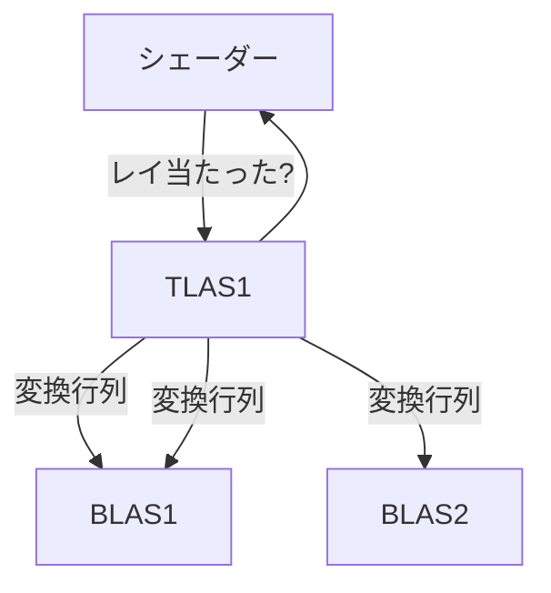

# なぜVKRなのか

VKRはVulkanでリアルタイムにレイトレーシングをする拡張で、[2020年12月](https://www.khronos.org/blog/vulkan-ray-tracing-final-specification-release)にSDKが配布されたようです。

:::message
VKRのチュートリアルをネットで探すと`VK_NV_ray_tracing`などのNvidia独自の拡張を使ったものが見つかるかもしれません。これは古いAPIなので避けたほうが良いかしれません。
といっても現在標準のKHR拡張とそこまで大きな違いがあるわけではありません。
:::

単にGPUでレイトレーシングしたいならVKR拡張がなくてもCompute Shaderを使えば実現できます([筆者が作った例](https://github.com/hatoo/rukako))。CPUよりはだいぶ速いです。

ではなぜわざわざ2018年1月からVKRの仕様を策定してきたかというと、(直接言及している文章を見たことがないので利用者目線から想像すると)[BVH](https://en.wikipedia.org/wiki/Bounding_volume_hierarchy)(VKRではAcceleration Structureと言います)の構築とレイの当たり判定をハードウェアも含めて最適化したいからといっていいでしょう(と思っています)^[ここの記述はてきとう]。

[Ray Tracing: The Next Week](https://raytracing.github.io/books/RayTracingTheNextWeek.html#boundingvolumehierarchies)のBounding Volume Hierarchiesをやった方ならわかるように、レイトレーシングのソフトウェアは多くの時間をレイの当たり判定に費やします。そこをGPUベンダに、ハードウェアも含めて最適化してもらえるのは非常にありがたいというわけです。

[AMDのページ](https://www.amd.com/ja/technologies/rdna-2)にある図。左側はメモリやキャッシュ関係があると考えると(想像)そこそこ大きな面積にレイトレーシング用のハードウェア"Ray Accelerator"があり(イメージ図だと思うが)、すごそう。

## ベンチマーク

大体同じシーンをCPU, GPU(Compute Shader), GPU(VKR)でレンダリングして時間を計測してみました。計測時間はプログラムの最初から最後までなのでセットアップにかかった時間やpngにエンコードする時間なども含んでいます。

1200x800ピクセル1000サンプルです

- CPU: 3950x
- GPU: RTX 2080ti

:::message alert
ベンチマークに使用したプログラムは筆者がつくったものですが全然最適化されていません。
あくまで参考程度にとらえてください。
:::

|   | CPU | GPU(Compute Shader) | GPU(VKR) |
| - | --- | ------------------- | -------- |
| 時間(秒) | 55.7 | 17.3 | 3.2 |

VKRだと速い。BVHの最適化を丸投げできるのがとても良い。

# Acceleration Structure

前節で、VKRの主なモチベーションはAcceleration Structure(以下AS)にある(と思う)と述べました。
ASはBVHと同じ働きをします。APIを呼ぶことでGPU上で構築したりシェーダーからレイの当たり判定をすることができます。(実際にはASの実装はGPUベンダの裁量によるので中でBVHとは違うすごいアルゴリズムが使われているかもしれませんが)
またASは、特定の条件を満たした際に低コストで再構築したり、シリアライズして例えば他のGPUで構築したASを他のGPUで使ったりする面白い機能もありますがこの文章では触れません。

一般的にBVHというとAABB(Axis Aligned Bounding Box)のほかにもOBB(Oriented Bounding Boxes)などが使われることもあるようですがVKRではAABBもしくはポリゴン(三角形)のみサポートされています。

## Top Level Acceleration StructureとBottom Level Acceleration Structure

ASはTop Level Acceleration Structure(以下TLAS)とBottom Level Acceleration Structure(BLAS)の二層構造です。
シェーダーからはTLASのみが見え、TLASは複数のBLASをその変換行列とともに持ちます。BLASは複数のポリゴン(三角形)もしくはAABBを持ちます。ポリゴンは非常によく使われる表現なため、特別にサポートされています。AABBの場合はその内部での当たり判定はIntersection Shaderを定義して計算します。TLASがポリゴン/AABBを保持することもBLASが他のBLASやTLASを持つこともありません。

# VKRのシェーダー達

VKRでは新たに

- Ray Generation Shader (レイトレーシングのエントリポイント)
- Intersections Shader (独自の形状に対してレイの当たり判定をする)
- Any-Hit Shader (レイは当たったけどやっぱりなかったことにすることができる(例えばレイは当たったけどテクスチャを見て透明だと判断したとき))
- Closest-Hit Shader (一通りレイの当たり判定が終わり一番近い衝突場所が分かったときに呼ばれる)
- Miss Shader (レイが何にも当たらなかったときに呼ばれる)
- Callable Shader (他のシェーダーから呼べるシェーダー。関数のようなものだが、別のシェーダーに切り分けることでスケジュールを最適化できる場合に使う(よくわかってない)([参考](https://www.reddit.com/r/vulkan/comments/gtqrym/use_case_for_callable_shaders/)))

のシェーダーが追加されました。
これらが協調してレイトレーシングをします。
Any-Hit ShaderとCallable Shaderはこの文章では実装しません。

## Ray Generation Shader

レイトレーシングのエントリポイントです。
これが出力のピクセルの数だけ呼ばれる(ようにする)のでここからGLSLでいう[TraceRayKHR](https://github.com/KhronosGroup/GLSL/blob/master/extensions/ext/GLSL_EXT_ray_tracing.txt)をつかうと他すべてのシェーダーが動き、その結果をみてピクセルを埋めます。

## Intersections Shader

独自の形状に対して当たり判定をするシェーダーです。BLASに登録したAABBにレイが当たっていた場合に呼ばれます。独自の形状を使わずポリゴンだけを使う場合は省略しても構いません。この文章では球の当たり判定を実装します。

## Any-Hit Shader

ここではレイの衝突をなかったことにできます。ここで衝突が破棄された場合、次に近い衝突場所に行きます。上記のようにレイは当たったけどテクスチャを見て透明だと判断したい時などに使えます。省略した場合はすべての衝突が採用されます。
Intersections Shaderの時点で処理してしまえばいいかと思うかもしれませんがテクスチャを見るなどの処理を可能な限り遅らせることができるという利点があります(その衝突箇所より前の時点で衝突していた場合、テクスチャを見なくてもその衝突は使わないと判断できる)。

## Closest-Hit Shader

Intersection ShaderとAny-Hit Shaderでいろいろやった後、最終的に衝突箇所が確定したときに呼ばれるシェーダーです。何にも当たらなかった場合はMiss Shaderが呼ばれます。ここでRay Generation Shaderに返すデータを作ります。最終的に確定された衝突でだけ法線やマテリアルの計算をすることで、無駄な計算をなくすことができます。

## Miss Shader

レイが何にも当たらなかったときに呼ばれるシェーダーです。例えば外界が空っぽい表現をしたいときはそういう計算をすればいいですし、光源から対象箇所にさえぎるモノがないか確認したいだけのシャドウレイの場合は真偽値を返せばよいというわけです。

# Shader Record

Interssection Shader, Any-Hit Shader, Closest-Hitは(それぞれ省略されることがあるものの)必ずセットで使われるため、これらをまとめたものをHit Group Recordと言います。 Ray Generation ShaderはRay Generation Record、Miss ShaderはMiss recordです。

# Shader Binding Table

Interssection Shaderで独自の形状の当たり判定を行うと書きましたが、独自の形状と一口に言っても同じシーンに球や直方体などの別の形状があるかもしれませんし、レイを飛ばすにしてもそれが通常のレイの場合もありますしシャドウレイを飛ばしたいだけの場合もあります。
つまり、使うシェーダーを動的に変化させる必要があるわけです。
それを実現するのがShader Binding Table(以下SBT)です。

:::message
この文章で登場する形状はすべて球なのでSBTの機能はほとんど使いません。
詳細を知りたい方は[Ray Tracing Gems II](https://www.realtimerendering.com/raytracinggems/rtg2/index.html)がおすすめです。
:::

シェーダーはすべて一次元配列に配置されていて、そのオフセットを動的に決めるというのがSBTです。

## Hit Groupの場合

Hit Groupのオフセットを決める値はあらかじめBLASに登録していく値と、実行時にRay Generation Shaderから渡す値に分かれます。

$$ HG_{index} = \mathbb{I}_{offset} + R_{offset} + R_{stride} \times \mathbb{G}_{ID} $$
$$ HG = addByteOffset(\& HG[0], HG_{stride} \times HG_{index}) $$

$HG_{stride}$は各Hit Group Recordが占めるバイト数です。
$\mathbb{I}_{offset}$と$\mathbb{G}_{ID}$はBLAS構築時に入力するのに対し、$R_{offset}$ + $R_{stride}$はRay Generation Shaderで指定します。
$\mathbb{G}_{ID}$ はBLASに入っている各子供のIDのため、大きくなることがあり$R_{stride} \times \mathbb{G}_{ID}$の項はあまり使わない気がします(初心者の想像)。
この文章では１つのHit Groupしか使わないため全部0です。

## Miss Groupの場合

 $$ M_{index} = R_{miss} $$
 $$ M = addByteOffset(\& M[0], M_{stride} \times M_{index}) $$

 Miss RecordはRay Generation Shaderから$R_{miss}$を指定するだけです。Closest-Hit Shaderと同じ型を返すMiss Shaderを指定しましょう。

 ## Ray Generationの場合

 一回の描画で使われるRay Generation Shaderは一種類だけです。VKRのAPIコール時にどのRay Generation Shaderを使うか指定するだけです。

# まとめ

これでVKRの最小限の説明が終わりました。あとは上のシェーダー群をrust-gpuで実装していい感じにVulkanのAPIを呼んでいくだけです。
