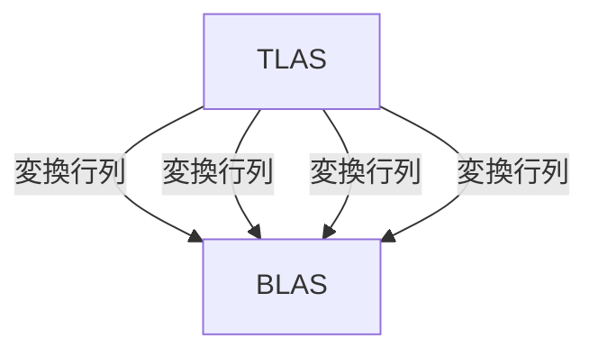

さっそくシェーダーを書いていきましょう。
コードは[こちら](https://github.com/hatoo/zenn-content/tree/master/raytracing-example)にあります。
文章内にコード片を記載していますが完全なコードではないのでリポジトリを確認してください。

まず、2章と同じセットアップをしてください。
rust-gpuでレイトレーシング拡張を有効にするために`build.rs`を変更します。
`bool`型はRustでは8ビットなので`Int8`も有効にします。

```rust:build.rs
use std::error::Error;

use spirv_builder::{Capability, MetadataPrintout, SpirvBuilder};

fn main() -> Result<(), Box<dyn Error>> {
    SpirvBuilder::new("./shader", "spirv-unknown-spv1.3")
        .capability(Capability::RayTracingKHR)
        .capability(Capability::Int8)
        .extension("SPV_KHR_ray_tracing")
        .print_metadata(MetadataPrintout::Full)
        .build()?;

    Ok(())
}
```

# 疑似乱数を実装する

疑似乱数はレイトレーシングのいたるところで使用されますがSPIR-Vには[rand(3)](https://linuxjm.osdn.jp/html/LDP_man-pages/man3/rand.3.html)のようなものはありませんし、[randクレート](https://crates.io/crates/rand)もコンパイルできません。
なので自分で実装していきます。

まず、疑似乱数のシードを得ようと思います。
今回は、ピクセルの座標とホストで作った乱数(Push Constantsで渡す)をxorしてシードとします。

```rust:shader/src/lib.rs
pub struct PushConstants {
    seed: u32,
}

// 前章で書いたようにレイトレーシングのエントリポイントはRay Generation Shader
#[spirv(ray_generation)]
pub fn main_ray_generation(
    // 対象のピクセルの座標
    #[spirv(launch_id)] launch_id: UVec3,
    // 出力のサイズ
    #[spirv(launch_size)] launch_size: UVec3,
    // Push Constants
    #[spirv(push_constant)] constants: &PushConstants,
) {
    let rand_seed = (launch_id.y * launch_size.x + launch_id.x) ^ constants.seed;
}
```

疑似乱数のアルゴリズムはいろいろありますが、今回は[PCGファミリ](https://www.pcg-random.org/index.html)の中から`pcg32si`を使うことにしました、GPUでは基本的に32bitアーキテクチャのようなので内部状態に32bitしか使わないものを選びました。周期が32bitと短めですが速さを期待します。

```rust:shader/src/rand.rs
pub struct PCG32si {
    state: u32,
}

impl PCG32si {
    const PCG_DEFAULT_MULTIPLIER_32: u32 = 747796405;
    const PCG_DEFAULT_INCREMENT_32: u32 = 2891336453;

    fn pcg_oneseq_32_step_r(&mut self) {
        self.state = self
            .state
            .wrapping_mul(Self::PCG_DEFAULT_MULTIPLIER_32)
            .wrapping_add(Self::PCG_DEFAULT_INCREMENT_32);
    }

    fn pcg_output_rxs_m_xs_32_32(state: u32) -> u32 {
        let word = ((state >> ((state >> 28).wrapping_add(4))) ^ state).wrapping_mul(277803737);
        (word >> 22) ^ word
    }

    pub fn new(seed: u32) -> Self {
        let mut rng = Self { state: seed };
        rng.pcg_oneseq_32_step_r();
        rng.state = rng.state.wrapping_add(seed);
        rng.pcg_oneseq_32_step_r();
        rng
    }

    pub fn next_u32(&mut self) -> u32 {
        let old_state = self.state;
        self.pcg_oneseq_32_step_r();
        Self::pcg_output_rxs_m_xs_32_32(old_state)
    }

    // 0.0..1.0
    pub fn next_f32(&mut self) -> f32 {
        let float_size = core::mem::size_of::<f32>() as u32 * 8;
        let precision = 23 + 1;
        let scale = 1.0 / ((1 << precision) as f32);

        let value = self.next_u32();
        let value = value >> (float_size - precision);
        scale * value as f32
    }

    pub fn next_f32_range(&mut self, min: f32, max: f32) -> f32 {
        min + (max - min) * self.next_f32()
    }
}

pub type DefaultRng = PCG32si;
```

実装は[PCGのC実装](https://github.com/imneme/pcg-c)からそのまま持ってきました。
`next_f32`は[randクレート](https://github.com/rust-random/rand/blob/master/src/distributions/float.rs#L107)から持ってきました。
また簡単のために、どうせこれ以上の乱数生成器を作る予定もないのでトレイトで抽象化をせず、`DefaultRng`として公開しています。

# カメラを実装する

ピクセル座標から、どの位置からどの方向にレイを飛ばすかを決定します。
[Ray Tracing in One Weekend](https://raytracing.github.io/books/RayTracingInOneWeekend.html)のカメラをそのまま持ってきます。

まず、`Ray`型を定義します。モーションブラーは今回は実装しないので位置と方向だけです。

```rust:shader/src/lib.rs
#[derive(Clone, Copy, Default)]
pub struct Ray {
    pub origin: Vec3,
    pub direction: Vec3,
}
```

`random_in_unit_disk`などの数学系の関数は`shader/src/math.rs`に実装することにします。

```rust:shader/src/math.rs
pub fn random_in_unit_disk(rng: &mut DefaultRng) -> Vec3 {
    loop {
        let p = vec3(
            rng.next_f32_range(-1.0, 1.0),
            rng.next_f32_range(-1.0, 1.0),
            0.0,
        );
        if p.length_squared() < 1.0 {
            break p;
        }
    }
}
```

```rust:shader/src/camera.rs
#[derive(Copy, Clone)]
pub struct Camera {
    origin: Vec3,
    lower_left_corner: Vec3,
    horizontal: Vec3,
    vertical: Vec3,
    u: Vec3,
    v: Vec3,
    // w: Vec3,
    lens_radius: f32,
}

impl Camera {
    #[allow(clippy::too_many_arguments)]
    pub fn new(
        look_from: Vec3,
        look_at: Vec3,
        vup: Vec3,
        vfov: f32,
        aspect_ratio: f32,
        aperture: f32,
        focus_dist: f32,
    ) -> Self {
        let theta = vfov;
        let h = (theta / 2.0).tan();
        let viewport_height = 2.0 * h;
        let viewport_width = aspect_ratio * viewport_height;

        let w = (look_from - look_at).normalize();
        let u = vup.cross(w).normalize();
        let v = w.cross(u);

        let origin = look_from;
        let horizontal = focus_dist * viewport_width * u;
        let vertical = focus_dist * viewport_height * v;
        let lower_left_corner = origin - horizontal / 2.0 - vertical / 2.0 - focus_dist * w;

        Self {
            origin,
            lower_left_corner,
            horizontal,
            vertical,
            u,
            v,
            // w,
            lens_radius: aperture / 2.0,
        }
    }

    pub fn get_ray(&self, s: f32, t: f32, rng: &mut DefaultRng) -> Ray {
        let rd = self.lens_radius * random_in_unit_disk(rng);
        let offset = self.u * rd.x + self.v * rd.y;

        Ray {
            origin: self.origin + offset,
            direction: (self.lower_left_corner + s * self.horizontal + t * self.vertical
                - self.origin
                - offset),
        }
    }
}
```

先ほど実装した乱数生成器を使ってデフォーカス・ブラーを実装しています。

# RayPayload型を作成

Closest-Hit ShaderとMiss Shaderの返り値の型をここで定義します。レイを飛ばしたとき、{Closest-Hit, Miss} Shaderのどちらからも値が返ってくる可能性があるため、両方の返り値はもちろん同じ型でなければなりません。
その型を`RayPayload`型とします。

`RayPayload`型にどのような情報が欲しいかというと...

- レイは当たったのか? (Closest-HitかMissか？)
- Missだった場合
    - その色 (もう二度と反射したりしないのでこれだけでよい)
- Closest-Hitだった場合
    - 衝突位置
    - 法線の方向
    - マテリアルのindex (マテリアルのリストをStorage Bufferで渡してindexで参照するようにすることにします)
    - レイは表からあたったのか?裏からあたったのか?

の情報があれば十分です。

素直に考えれば上記は`enum`で表現できますが、ここで**注意点**があります。
Vulkanのメモリモデルは基本的にロジカルポインタです。つまり、ポインタに数値を足したり引いたりすることはできないしキャストすることもできません。rust-gpuにはポインタは存在せず、参照のみ存在すると考えると理解しやすいでしょう。

Rustの`enum`は、各バリアントに対してそれにマッチしてデータが欲しいときにデータ部分に対してキャストをします(上記のようにこれはできません!)。つまり事実上、rust-gpuでは`Option<T>`も含め`enum`を使うことは(現状)できません。
[#78](https://github.com/EmbarkStudios/rust-gpu/issues/78), [#234](https://github.com/EmbarkStudios/rust-gpu/issues/234)

しょうがないので`struct`で表現し、内部の値によって使うメンバを変えることにします。
```rust:shader/src/lib.rs
#[derive(Clone, Default)]
pub struct RayPayload {
    // レイは当たったのか?
    pub is_miss: bool,
    // Missの場合その色。Closest-Hitの場合その位置
    pub position: Vec3,
    // 法線
    pub normal: Vec3,
    // マテリアルの番号
    pub material: u32,
    // 表からレイが当たったのかどうか　
    pub front_face: bool,
}
```

# Miss Shaderの作成

`RayPayload`型が定義できたので早速Miss Shaderを書いていきます。といってもRay Tracing in One Weekendと同じように空を描くだけです。

```rust:shader/src/lib.rs
#[spirv(miss)]
pub fn main_miss(
    // レイの方向
    #[spirv(world_ray_direction)] world_ray_direction: Vec3,
    // RayPayload
    #[spirv(incoming_ray_payload)] out: &mut RayPayload,
) {
    let unit_direction = world_ray_direction.normalize();
    let t = 0.5 * (unit_direction.y + 1.0);
    let color = vec3(1.0, 1.0, 1.0).lerp(vec3(0.5, 0.7, 1.0), t);

    *out = RayPayload {
        is_miss: true,
        position: color,
        ..Default::default()
    };
}
```

前述したように`position`に空の色を入れています。

# Intersection, Closest-Hit Shaderの作成

目的とするシーンには球しか存在しないので、球のためのIntersection ShaderとClosest-Hit Shaderを作るだけです。
BLASに中心が原点で長さが2のAABB(半径1の球)を用意、TLASから変換行列(拡大含む)でそのBLASを参照していく想定です。
レイを移動させると実質対象の物体を動かしたことになることを思い出してください。やっていない方は[Ray Tracing: The Next Week](https://raytracing.github.io/books/RayTracingTheNextWeek.html#instances)のInstancesをやるとよいでしょう。



```rust:shader/src/lib.rs
impl RayPayload {
    pub fn new(position: Vec3, outward_normal: Vec3, ray_direction: Vec3, material: u32) -> Self {
        let front_face = ray_direction.dot(outward_normal) < 0.0;
        let normal = if front_face {
            outward_normal
        } else {
            -outward_normal
        };

        Self {
            position,
            normal,
            is_miss: false,
            front_face: front_face,
            material,
        }
    }
}
#[spirv(intersection)]
pub fn sphere_intersection(
    // TLASで登録した変換行列の逆を変換したレイの原点
    #[spirv(object_ray_origin)] ray_origin: Vec3,
    // TLASで登録した変換行列の逆を変換したレイの方向
    #[spirv(object_ray_direction)] ray_direction: Vec3,
    // レイの開始時間
    #[spirv(ray_tmin)] t_min: f32,
    // レイの終了時間
    #[spirv(ray_tmax)] t_max: f32,
    // ここで値を書くとClosest-Hitから読める
    // レイがの衝突時刻を書き込むことにする
    #[spirv(hit_attribute)] t: &mut f32,
) {
    // Ray Tracing in One Weekendの球の当たり判定そのまま
    // レイは変換済みなので常に原点、半径1の球に対する判定をすればよい。
    let oc = ray_origin;
    let a = ray_direction.length_squared();
    let half_b = oc.dot(ray_direction);
    let c = oc.length_squared() - 1.0;

    let discriminant = half_b * half_b - a * c;
    if discriminant < 0.0 {
        return;
    }

    let sqrtd = discriminant.sqrt();

    let root0 = (-half_b - sqrtd) / a;
    let root1 = (-half_b + sqrtd) / a;

    if root0 >= t_min && root0 <= t_max {
        // 小さい方の解が当たっている
        *t = root0;
        unsafe {
            report_intersection(root0, 0);
        }
        return;
    }

    if root1 >= t_min && root1 <= t_max {
        // 大きい方の解が当たっている
        *t = root1;
        unsafe {
            report_intersection(root1, 0);
        }
    }
}

// glamの行列はSPIR-Vの行列型にはなっていないためここで行列型を作る
// 具体的には#[spirv(matrix)]した型はSPIR-Vの`OpTypeMatrix`の型となる
#[derive(Clone, Copy)]
#[spirv(matrix)]
#[repr(C)]
pub struct Affine3 {
    pub x: Vec3,
    pub y: Vec3,
    pub z: Vec3,
    pub w: Vec3,
}

#[spirv(closest_hit)]
pub fn sphere_closest_hit(
    // Intersectionで入れたレイの衝突時刻
    #[spirv(hit_attribute)] t: &f32,
    // TLASで登録した変換行列
    #[spirv(object_to_world)] object_to_world: Affine3,
    // レイの位置
    #[spirv(world_ray_origin)] world_ray_origin: Vec3,
    // レイの方向
    #[spirv(world_ray_direction)] world_ray_direction: Vec3,
    // RayPayload。これがRay Generationに返る
    #[spirv(incoming_ray_payload)] out: &mut RayPayload,
    // TLASで登録した番号。これをマテリアルのindexとする
    #[spirv(instance_custom_index)] instance_custom_index: u32,
) {
    // レイの衝突位置、法線をここで計算する。Intersectionで行わないことで計算を遅延していることに注意、
    let hit_pos = world_ray_origin + *t * world_ray_direction;
    // object_to_world.wに変換行列の平行移動の部分が入っている。
    let normal = (hit_pos - object_to_world.w).normalize();
    *out = RayPayload::new(hit_pos, normal, world_ray_direction, instance_custom_index);
}
```